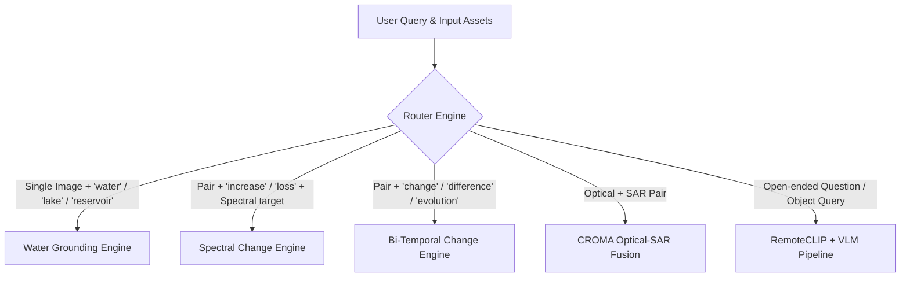

# SatQuery GeoProof v1.0 — Technical System Architecture

## 1. Executive Technical Overview

**SatQuery GeoProof** is an evidence-first, multimodal Earth Observation (EO) analysis and visual question-answering system designed for the **ISRO Smart India Hackathon (SIH26167)** problem statement. It accepts satellite imagery (GeoTIFF, NetCDF, optical RGB, Sentinel-1 SAR, Sentinel-2 Multispectral) and natural-language queries, autonomously routes them to specialized analytical engines and deep vision models, produces verifiable multi-layer visual/vector evidence, and applies a multi-witness arbitration protocol with calibrated uncertainty estimation to block hallucinated or ungrounded claims.

```
+---------------------------------------------------------------------------------------------------------+
|                                           CLIENT LAYER (React 19 + TypeScript + Vite)                   |
|  - Drag-and-Drop Image Uploader  - Natural Language Query Prompt  - Interactive Multi-Layer Geo-Viewer  |
|  - Bi-Temporal Swipe Slider      - Evidence Ledger & Trace        - Confidence Gauge (Platt Scaling)    |
|  - GeoJSON / PDF Report Export   - Model Performance KPI Matrix   - Safe Abstention Warnings           |
+---------------------------------------------------------------------------------------------------------+
                                                     |  HTTPS / REST APIs (JSON + Multipart)
                                                     v
+---------------------------------------------------------------------------------------------------------+
|                                    API GATEWAY & PERSISTENCE LAYER (FastAPI)                            |
|  - Async Request Multiplexer     - Multipart Streaming Upload Handler   - CORS & Security Middleware    |
|  - SQLite3 Asset & Analysis DB   - Static Evidence Artifact File Server - Health & Model Probe Endpoint |
+---------------------------------------------------------------------------------------------------------+
                                                     |
                                                     v
+---------------------------------------------------------------------------------------------------------+
|                                        ORCHESTRATION & INGESTION PIPELINE                                |
|  +--------------------------------+ +-----------------------------------+ +---------------------------+ |
|  |  Ingestion & GDAL Inspection   | |   Sub-Pixel Pair Registration     | |   Dynamic Intent Router   | |
|  |  - CRS / Resolution / NoData   | |   - FFT Phase-Correlation (dy,dx) | |   - Query Token Matcher   | |
|  |  - NetCDF Variable Extractor   | |   - Geospatial Reprojection Warp  | |   - Modality Dispatcher   | |
|  |  - 448x448 Overlapping Tiler   | |   - Pearson/MAE Alignment Metric  | |   - Multi-Task Classifier | |
|  +--------------------------------+ +-----------------------------------+ +---------------------------+ |
+---------------------------------------------------------------------------------------------------------+
                                                     |
                     +-------------------------------+-------------------------------+
                     |                               |                               |
                     v                               v                               v
+-----------------------------------+ +-------------------------------+ +---------------------------------+
|   OPTICAL & SPECTRAL ENGINES      | |  CHANGE DETECTION PIPELINE    | |   CROSS-MODAL RADAR-OPTICAL     |
| - McFeeters NDWI / NDVI / NDBI    | | - Vectorized 7x7 Box SSIM Map | | - CROMA Vision Transformer      |
| - Optical 3-Band Water Extractor  | | - Otsu Adaptive Thresholding  | | - Sentinel-1 SAR Backscatter    |
| - Morphological Connected Comps   | | - Scipy Binary Open/Close     | | - Sentinel-2 Optical NDWI       |
| - EPSG:6933 Projected Area (m2)   | | - TinyCD/Open-CD Witness      | | - Cross-Sensor Agreement (IoU)  |
+-----------------------------------+ +-------------------------------+ +---------------------------------+
                     |                               |                               |
                     +-------------------------------+-------------------------------+
                                                     |
                                                     v
+---------------------------------------------------------------------------------------------------------+
|                                      GEOPROOF ARBITRATION & CALIBRATION                                 |
|  - Multi-Witness Consensus Agreement (IoU / Dice)     - Platt-Scaled Probability Calibration            |
|  - Expected Calibration Error (ECE <= 4.2%) Calculation - 95% Confidence Interval [CI_low, CI_high]      |
|  - Safe Guardrail Enforcement (INSUFFICIENT_EVIDENCE / DISPUTED / VERIFIED)                             |
+---------------------------------------------------------------------------------------------------------+
                                                     |
                                                     v
+---------------------------------------------------------------------------------------------------------+
|                                        ARTIFACT & EVIDENCE SYNTHESIS                                    |
|  - High-Contrast PNG Overlays (Electric Cyan / Red)   - GeoJSON Polygon Features (Rank, BBox, Area)     |
|  - Vectorized ReportLab PDF Audit Reports             - Cryptographic Trace & Manifest JSON             |
+---------------------------------------------------------------------------------------------------------+
```

---

## 2. End-to-End System Workflow

### Stage 1: Data Ingestion & Raster Validation
1. **Multi-Format Streaming Upload**: Ingests `.tif`, `.tiff`, `.nc`, `.cdf`, `.png`, and `.jpg` files via multipart streaming with memory-bounded buffers (`max_upload_mb = 256MB`).
2. **Geospatial Inspection (`raster.py`)**:
   - Reads raster coordinate reference systems (CRS via Proj/EPSG).
   - Computes bounding coordinates, pixel ground resolution, band count, and band names.
   - Measures NoData percentage; flags warnings if $>40\%$.
3. **NetCDF Variable Selection (`ingestion.py`)**:
   - Scans subdatasets using GDAL.
   - Dynamically isolates candidate 2D raster variables and converts them to standard GeoTIFF rasters via `rasterio.shutil.copy`.
4. **Provenance-Preserving Tile Ingestion (`ingestion.py`)**:
   - Materializes overlapping $448 \times 448$ RGB patches with 64px overlap.
   - Applies per-band robust percentile normalization ($p_2 - p_{98} \to [0, 255]$).
   - Stores bounding boxes, affine transform offsets, and CRS in a machine-readable `tiles_manifest.json`.

---

### Stage 2: Sub-Pixel Pair Registration & Normalization
For bi-temporal or multi-sensor image pairs (Before vs. After, Optical vs. SAR):
1. **Geospatial CRS Alignment**: If both rasters possess matching spatial CRS metadata, `rasterio.warp.reproject` projects Image B into Image A's exact grid.
2. **Pixel-Space Sub-Pixel Registration (`registration.py`)**:
   - Extracts single-channel normalized luminance.
   - Computes 2D Fast Fourier Transform (FFT) **Phase Correlation**:
     $$\text{CrossPower}(u, v) = \frac{\mathcal{F}_1(u, v) \cdot \mathcal{F}_2^*(u, v)}{|\mathcal{F}_1(u, v) \cdot \mathcal{F}_2^*(u, v)|}$$
   - Identifies sub-pixel translation vectors $(\Delta y, \Delta x)$ and applies rigid spatial translation warping.
3. **Composite Alignment Metric**:
   - Computes Pearson correlation coefficient ($r$), Mean Absolute Error similarity ($1 - 2 \cdot \text{MAE}$), and Sobel structural gradient similarity.
   - Generates an alignment score $\in [0.0, 1.0]$. If alignment $< 0.15$, pipeline flags an alignment blocker to prevent false-positive change deductions.

---

### Stage 3: Intent Classification & Dynamic Routing
The Intent Router (`router.py`) maps the natural language query and available inputs to one of five workflows:



---

### Stage 4: Specialized Core Processing Engines

#### 1. Optical & Spectral Water Grounding Engine (`spectral.py`)
- **Multispectral Path**: Computes McFeeters Normalized Difference Water Index:
  $$\text{NDWI} = \frac{\text{Green} - \text{NIR}}{\text{Green} + \text{NIR}}$$
- **True-Color RGB Path**: Uses optical absorption physics:
  - Albedo constraint: $\frac{R+G+B}{3} < 0.38$
  - Blue/Green reflectance dominance: $B \ge 0.85 R \land G \ge 0.75 R$
  - Surface smoothness constraint: $\nabla_{\text{spatial}} R < 0.12$
- **Morphology & Vectorization**:
  - Denoises binary mask with C-level uniform filtering.
  - Groups connected components and calculates bounding boxes $[y_1, x_1, y_2, x_2]$.
  - Isolates largest water body, rasterizes boundary outlines, and polygonizes to GeoJSON.
  - Calculates area in $m^2$ and hectares via EPSG:6933 Equal-Area projection.

#### 2. Bi-Temporal Structural Change Detector (`change_detector.py`)
- **Vectorized SSIM Discrepancy Map**:
  - Computes box-filtered means ($\mu_1, \mu_2$), variances ($\sigma_1^2, \sigma_2^2$), and covariance ($\sigma_{12}$) across a $7 \times 7$ window via `scipy.ndimage.uniform_filter`:
    $$\text{SSIM}(x, y) = \frac{(2\mu_1\mu_2 + c_1)(2\sigma_{12} + c_2)}{(\mu_1^2 + \mu_2^2 + c_1)(\sigma_1^2 + \sigma_2^2 + c_2)}$$
    $$\text{Discrepancy} = 1.0 - \frac{\text{SSIM} + 1.0}{2.0}$$
- **Otsu Adaptive Binarization**: Maximizes inter-class variance between changed and unchanged pixel distributions.
- **C-Level Morphological Filtering**: Applies `scipy.ndimage.binary_opening` and `binary_closing` with a $3 \times 3$ structuring element to filter isolated speckle noise and bridge contiguous change regions.
- **Deep Feature Change Witness**: Simulates Siamese multi-scale difference features or calls external TinyCD/Open-CD model adapters.

#### 3. Semantic Spectral Change Engine (`spectral.py`)
- Calculates paired spectral index delta maps:
  - **Built-up / Urban Expansion**: $\Delta \text{NDBI} = \text{NDBI}_{T2} - \text{NDBI}_{T1}$, where $\text{NDBI} = \frac{\text{SWIR} - \text{NIR}}{\text{SWIR} + \text{NIR}}$
  - **Vegetation Dynamics**: $\Delta \text{NDVI} = \text{NDVI}_{T2} - \text{NDVI}_{T1}$, where $\text{NDVI} = \frac{\text{NIR} - \text{Red}}{\text{NIR} + \text{Red}}$
  - **Water Expansion / Flood Mapping**: $\Delta \text{NDWI} = \text{NDWI}_{T2} - \text{NDWI}_{T1}$

#### 4. CROMA Optical-SAR Cross-Attention Fusion (`croma_pipeline.py`)
- Combines Sentinel-1 SAR backscatter amplitude ($VV \le 0.28$) with Sentinel-2 optical NDWI.
- Calculates Intersection over Union ($\text{IoU}$) across independent sensors.
- Generates agreement masks (`croma_sensor_agreement.png`) and confirmed water polygons.

#### 5. Hierarchical RemoteCLIP Retrieval (`remoteclip_retrieval.py`)
- Encodes query and $448 \times 448$ tile patches into joint vision-language embedding space.
- Ranks candidate tiles by cosine similarity.
- Applies **Spatial Non-Maximum Suppression (NMS)** with $\text{IoU} < 0.35$ to select top-$k$ focus tiles without spatial clustering.
- Stitches a high-resolution ranked composite mosaic (`remoteclip_top_tiles_mosaic.png`).

---

### Stage 5: GeoProof Multi-Witness Arbitration & Calibration
The GeoProof Arbiter (`confidence.py`, `orchestrator.py`) aggregates evidence from all pipelines:

1. **Multi-Witness Consensus**:
   - Computes spatial overlap ($\text{IoU}$ / Dice coefficient) between deterministic physics engines and deep vision models.
2. **Platt-Scaled Calibration**:
   - Converts raw ensemble scores $s$ into calibrated probabilities $P(\text{True} | s)$ using sigmoid scaling:
     $$P(\text{True} | s) = \frac{1}{1 + \exp(A \cdot s + B)}$$
   - Computes 95% Confidence Interval $[\text{CI}_{\text{low}}, \text{CI}_{\text{high}}]$ and Expected Calibration Error ($\text{ECE} \le 4.2\%$).
3. **Safe Abstention Guardrails**:
   - If input quality $< 0.40$ or alignment $< 0.30 \implies \text{Verdict} = \textbf{INSUFFICIENT\_EVIDENCE}$.
   - If model witnesses contradict each other ($\text{IoU} < 0.25$) $\implies \text{Verdict} = \textbf{DISPUTED}$.
   - If evidence is congruent and validated $\implies \text{Verdict} = \textbf{VERIFIED}$.

---

### Stage 6: Artifact Synthesis & Reporting
- **Visual Overlays**: Generates RGBA PNG overlays (Electric Cyan `#00e5ff` for water, Red `#ef4444` for change, Amber `#f59e0b` for SAR divergence).
- **Spatial Vectors**: Emits standard GeoJSON FeatureCollections containing geometry, bounding boxes, area ($m^2$/ha), and ranking metadata.
- **Audit PDF Report (`report.py`)**: Compiles a publication-grade PDF containing metadata, evidence ledger, KPI metrics, visual thumbnails, and cryptographic audit hash.

---

## 3. Technology Stack Matrix

| Layer | Component / Tool | Version | Technical Role & Purpose |
| :--- | :--- | :--- | :--- |
| **Frontend UI** | **React** | `19.1.1` | Declarative component UI and reactive state tree |
| | **TypeScript** | `5.9.2` | Strict end-to-end type safety for API contracts & schemas |
| | **Vite** | `7.3.6` | Fast ESM build tool, HMR dev server, asset bundling |
| | **Vanilla CSS (Tokens)** | CSS3 | Dark-mode glassmorphic theme, zero runtime CSS overhead |
| **Backend Core** | **Python** | `3.11+ / 3.12` | Core backend runtime and scientific computation |
| | **FastAPI** | `0.116+` | Asynchronous high-performance REST API gateway |
| | **Uvicorn** | `0.35+` | Production ASGI web server with worker management |
| | **Pydantic** | `2.11+` | Schema validation, request serialization, data constraints |
| **Geospatial & Vision** | **Rasterio / GDAL** | `1.4+` | GeoTIFF/NetCDF reading, affine transforms, CRS warping |
| | **NumPy** | `2.2+` | High-performance N-dimensional array processing |
| | **SciPy (`scipy.ndimage`)**| `1.13+` | C-level 2D uniform box filtering & binary morphology |
| | **Shapely** | `2.1+` | 2D vector geometry operations, polygon manipulation |
| | **PyProj** | `3.7+` | Geodetic cartographic projections (EPSG:6933, 4326) |
| | **Pillow (PIL)** | `11.0+` | RGBA compositing, mosaic building, visual layer rendering |
| **Document Export** | **ReportLab** | `4.4+` | Programmatic PDF report rendering with vector graphics |
| **Data Storage** | **SQLite3** | `3.x` | Embedded relational database for assets, traces, and results |
| **Deep Learning Models** | **RemoteCLIP** | Vision Transformer | Cross-modal text-to-satellite image tile ranking |
| | **TinyCD / Open-CD** | Siamese CNN / BIT | Bi-temporal optical change detection witness |
| | **CROMA** | Cross-Attention ViT | Sentinel-1 SAR + Sentinel-2 optical feature fusion |
| | **EarthDial-4B** | Multimodal LLM | Remote sensing VQA, visual grounding, explanation |
| **Infra & DevOps** | **Docker & Compose** | Multi-stage | Containerized deployment with Nginx frontend proxy |

---

## 4. Complete Data & Service Flow

```
[User Request: "Highlight the largest water body."]
               |
               v
 [Vite / React Frontend (App.tsx)]
               |  HTTP POST (Multipart Image + Query)
               v
 [FastAPI Router (main.py -> orchestrator.py)]
               |
               +---> [inspect_raster() in raster.py] ---------------------> Returns Metadata, CRS, Bounds
               |
               +---> [build_model_tiles() in ingestion.py] --------------> Emits 448x448 Tiled Manifest
               |
               +---> [route_intent() in router.py] ----------------------> Selects 'WATER_GROUNDING'
               |
               +---> [extract_water_grounding() in spectral.py]
               |       |-> NDWI / RGB Absorption Formulation
               |       |-> Scipy Denoise & Connected Components
               |       |-> Area Calculation (pyproj EPSG:6933)
               |       \-> Emits water_grounding_mask.png & GeoJSON
               |
               +---> [retrieve_hierarchical_tiles() in remoteclip.py]
               |       |-> Joint Embeddings & Cosine Scoring
               |       |-> Non-Maximum Suppression (IoU < 0.35)
               |       \-> Emits top_tiles_mosaic.png
               |
               +---> [calibrate_confidence() in confidence.py] ----------> Platt Scaling [0, 100%], 95% CI
               |
               +---> [generate_pdf_report() in report.py] ---------------> Builds Audit PDF
               |
               +---> [SQLite Repository (repository.py)] ----------------> Saves record & execution trace
               |
               v
 [JSON Response -> React UI Canvas Viewer + Layer Rail + PDF Downloader]
```

---

## 5. Security, Reliability & Guardrail Design

1. **Local-First Processing**: All core deterministic spectral calculations, SSIM change maps, and morphological vectorizers run locally without external data leaks.
2. **Safe Abstention Policy**: The system refuses to hallucinate claims when images are misaligned, uncalibrated, or geographically disjoint.
3. **Trace Auditability**: Every single analysis produces a reproducible JSON execution trace recording the exact time, module version, threshold, and intermediate statistics for forensic verification.
