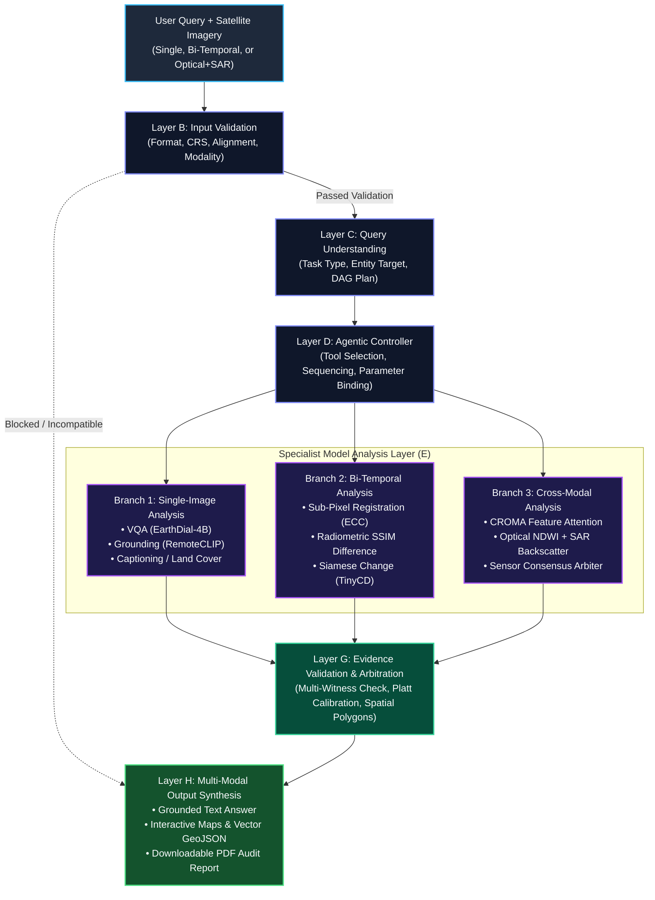
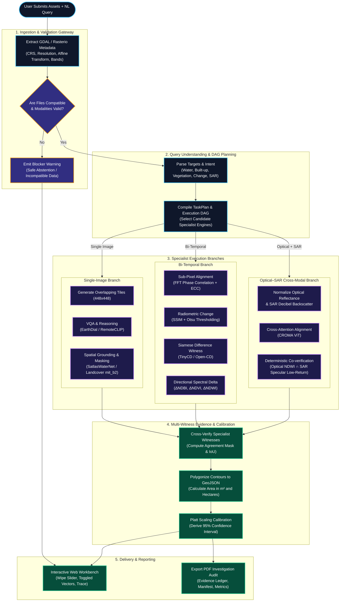
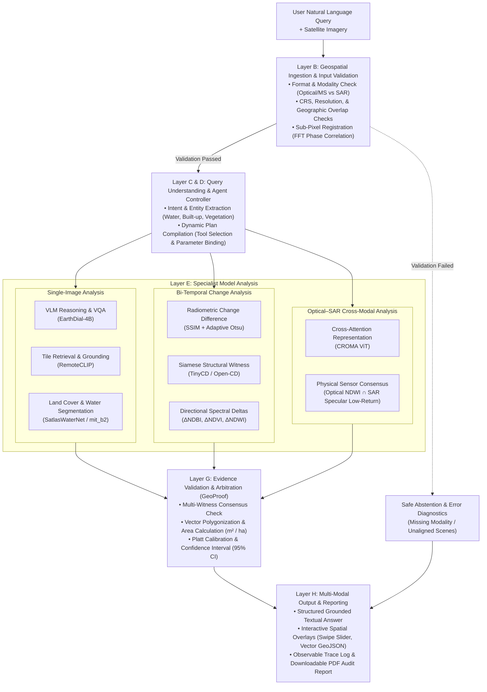

# SatQuery AI: System Architecture, Research Design & Engineering Specification

> **System Designation:** SatQuery AI — Interactive Multimodal Vision-Language Assistant for Remote Sensing  
> **Problem Statement:** SIH26167 (ISRO / Smart India Hackathon)  
> **Document Type:** Architectural Blueprint & Research Design Proposal (Conceptual Design)  
> **Notice:** This document outlines a technically grounded, rigorous system design tailored specifically to the problem statement requirements without assuming pre-existing experimental completion.

---

## 1. End-to-End Architectural Decomposition

SatQuery AI is designed as an evidence-first, agent-orchestrated multimodal intelligence pipeline. It bridges geospatial satellite data engineering (GeoTIFF, CRS projections, radiometric physics) with modern Vision-Language Models (VLMs) and deep neural vision specialists.

```
┌────────────────────────────────────────────────────────────────────────┐
│                        USER INTERFACE LAYER (A)                        │
└───────────────────────────────────┬────────────────────────────────────┘
                                    │ Uploads (GeoTIFF/PNG) + NL Query
                                    ▼
┌────────────────────────────────────────────────────────────────────────┐
│                     INPUT VALIDATION LAYER (B)                         │
└───────────────────────────────────┬────────────────────────────────────┘
                                    │ Validated Metadata & Spatial Checks
                                    ▼
┌────────────────────────────────────────────────────────────────────────┐
│                    QUERY UNDERSTANDING LAYER (C)                       │
└───────────────────────────────────┬────────────────────────────────────┘
                                    │ Structured Task Plan (Intent/Target)
                                    ▼
┌────────────────────────────────────────────────────────────────────────┐
│                        AGENTIC CONTROLLER (D)                          │
└───────────────────────────────────┬────────────────────────────────────┘
                                    │ Tool Sequence & Parameter Bindings
         ┌──────────────────────────┼──────────────────────────┐
         ▼                          ▼                          ▼
┌─────────────────┐        ┌─────────────────┐        ┌─────────────────┐
│ SINGLE-IMAGE    │        │ BI-TEMPORAL     │        │ OPTICAL–SAR     │
│ SPECIALISTS (E) │        │ SPECIALISTS (E) │        │ SPECIALISTS (E) │
└────────┬────────┘        └────────┬────────┘        └────────┬────────┘
         └──────────────────────────┼──────────────────────────┘
                                    │ Candidate Artifacts & Logits
                                    ▼
┌────────────────────────────────────────────────────────────────────────┐
│                EVIDENCE & ARBITRATION LAYER (G)                        │
└───────────────────────────────────┬────────────────────────────────────┘
                                    │ Calibrated Verdict & Visual Layers
                                    ▼
┌────────────────────────────────────────────────────────────────────────┐
│                   OUTPUT & REPORTING LAYER (H)                         │
└────────────────────────────────────────────────────────────────────────┘
```

---

### Layer A: User Interface (UI) Layer

The UI layer serves as the interactive workbench for geospatial intelligence analysts, mission planners, and researchers.

* **Modal Image Upload Interface:**
  * **Single-Image Viewport:** Handles high-resolution optical, multispectral, or land-cover tiles.
  * **Bi-Temporal Viewport:** Dual-slot uploader labeled *Time $T_1$ (Before)* and *Time $T_2$ (After)* with temporal metadata taggers (acquisition date, sensor type).
  * **Cross-Modal Viewport:** Dual-slot uploader labeled *Optical/Multispectral Sensor* (e.g., Sentinel-2 / Cartosat-2S) and *SAR Sensor* (e.g., Sentinel-1 / RISAT-1A).
* **Natural-Language Query Console:** An input bar supporting open-ended domain queries (e.g., *"What is the dominant land cover class?"*, *"Detect urban growth between these dates"*, *"Identify water bodies where optical and SAR both agree"*). Includes quick-start templates mapping to benchmark tasks.
* **Synchronized Geospatial Canvas:**
  * Interactive raster/vector viewport (Leaflet / OpenLayers / MapLibre GL).
  * Split-screen comparative wipe/swipe slider for bi-temporal and optical–SAR inspections.
  * Toggled vector layer overlays (GeoJSON polygons for detected changes, water boundaries, building footprints).
* **Artifacts & Ledger Console:** Docked inspection rails displaying the agent's observable execution trace, active tool status, quantitative confidence scores, and one-click PDF export buttons.

---

### Layer B: Input Validation Layer

Geospatial AI pipelines are vulnerable to silent data corruption when models run on uncalibrated, unprojected, or mismatched inputs. This layer acts as a strict programmatic gateway prior to any model inference.

* **File-Type & Container Discovery:** Uses GDAL/Rasterio to inspect input binary streams. Accepts native GeoTIFF (`.tif`, `.tiff`) and NetCDF (`.nc`, `.nc4`, `.h5`). Permissively ingests raw optical benchmarks (`.png`, `.jpg`) by tagging them as *Unprojected Pixel Grids*.
* **Geospatial Metadata Extraction:**
  * Coordinate Reference System (CRS) parsing (e.g., `EPSG:4326`, `EPSG:32643`).
  * Affine Geotransform matrix extraction: pixel size ($\Delta x, \Delta y$), origin coordinates ($x_0, y_0$), and rotation.
  * Spatial footprint bounding box: $[\text{min}_x, \text{min}_y, \text{max}_x, \text{max}_y]$.
  * Band attributes: band count, channel labels (Red, Green, Blue, NIR, SWIR1, SWIR2), data depth (uint8, uint16, float32), and explicit `NoData` pixel values.
* **Modality Identification:**
  * Distinguishes 3-band true-color RGB from multispectral imagery ($\ge 4$ bands).
  * Automatically detects SAR imagery by examining band description tags (`VV`, `VH`, `HH`, `HV`) or radiometric distributions (negative decibel values $dB$ with characteristically high speckle variance).
* **Pair Compatibility & Alignment Verification:**
  * **Bi-Temporal Check:** Verifies that $T_1$ and $T_2$ share overlapping geographic bounding boxes ($> 80\%$ intersection required for full-scene evaluation). Computes spatial resolution ratio ($R_{T1} / R_{T2}$); resamples to the finer grid or common base if within an allowable $4\times$ factor.
  * **Optical–SAR Check:** Confirms that Cartosat-2S/S-2 and RISAT/S-1 imagery cover the same AOI. Verifies that SAR imagery is terrain-corrected (orthorectified) and co-registered.
  * **Alignment Quality Metric:** Computes normalized Phase Correlation on overlapping gradients. If the alignment score is $< 0.15$ (indicating totally disparate or unaligned scenes), the pipeline blocks execution to prevent hallucinated changes.
* **Temporal Metadata Validation:** Extracts acquisition timestamps from GeoTIFF TIFFTAGs or file headers to guarantee that $T_1 < T_2$ in bi-temporal workflows.

---

### Layer C: Query Understanding Layer

This layer converts unconstrained human instructions into an unambiguous, typed analytical schema (`TaskPlan`).

* **Intent & Entity Extraction:**
  * **Target Entities:** Surface water, vegetation/forest canopy, built-up structures/buildings, road networks, or general land cover.
  * **Analytical Task Class:**
    1. Single-Image VQA (`vqa`)
    2. Single-Image Visual Grounding (`grounding`)
    3. Single-Image Captioning / Scene Description (`captioning`)
    4. Bi-Temporal Change Detection & Description (`bi_temporal_change`)
    5. Optical–SAR Joint Analysis (`optical_sar`)
  * **Directional/Temporal Qualifiers:** Detection of temporal verbs (*"increased"*, *"shrunk"*, *"expanded"*, *"cleared"*, *"between 2021 and 2024"*).
* **Input-to-Task Matching:**
  * Compares query intent against uploaded assets.
  * *Contradiction Resolution:* If a user submits a single image but asks *"What changed between these dates?"*, the parser flags a missing input requirement (`REQUIREMENT_UNMET`) instead of fabricating temporal answers.
* **Multi-Intent Decomposition:**
  * Complex queries (e.g., *"Describe the land cover and delineate the largest water reservoir"*) are factored into sub-tasks: `[scene_description, water_grounding]`.

---

### Layer D: Agentic Controller

The Agentic Controller is the deterministic orchestrator that plans, parameter-binds, sequences, and monitors model execution. It avoids open-ended, non-deterministic reasoning loops by enforcing a bounded Directed Acyclic Graph (DAG) for each task class.

```
                    ┌─────────────────────────┐
                    │       TaskPlan          │
                    └────────────┬────────────┘
                                 │
                                 ▼
                    ┌─────────────────────────┐
                    │ Tool/Model Registry     │
                    │ - Capabilities          │
                    │ - Band Prerequisites    │
                    │ - Execution Contracts   │
                    └────────────┬────────────┘
                                 │
                   DAG Dynamic Plan Compilation
                                 │
        ┌────────────────────────┼────────────────────────┐
        ▼                        ▼                        ▼
Step 1: Ingestion &      Step 2: Specialist       Step 3: Multi-Witness
Tiling (448x448)         Execution (DL/Spectral)  Consensus & Arbitration
```

* **Tool & Model Registry:** A declarative manifest defining each tool's functional contract:
  * `tool_name`: Unique string identifier.
  * `supported_tasks`: List of task tags (`vqa`, `change`, `grounding`, etc.).
  * `prerequisites`: Required modalities (e.g., `["optical_nir", "optical_swir"]` or `["sar_vv", "sar_vh"]`).
  * `invocation_type`: `in_process_pytorch`, `deterministic_algorithm`, or `http_microservice`.
* **Sequencing Logic:**
  * Implements pre-conditions and post-conditions (e.g., Sub-pixel registration must complete successfully before differential change models are triggered).
* **Execution Logging & Observability:**
  * Generates an append-only execution trace: `TraceStep(step, component, action, status, duration_ms, details)`.
  * Logs explicit parameter bindings (Otsu threshold values, NMS IoU cutoffs, sliding-window tile overlaps) for auditability.

---

### Layer E: Specialist Model Layer

The specialist layer houses dedicated deep-learning backbones and deterministic physical algorithms. Each model is tailored to a distinct physical phenomenon.

| Model / Engine | Proposed Task | Suitability Rationale | Input Specifications | Known Limitations | Implementation Status |
| :--- | :--- | :--- | :--- | :--- | :--- |
| **EarthDial-4B** (or GeoLLaVA / RS-VLM) | Remote-Sensing VQA & Reasoning | Transformer LLM adapted with remote-sensing visual tokens; understands spatial relations from nadir views. | 3-band RGB or 5-band Optical ($512 \times 512$ tiles), tokenized text query. | High GPU memory footprint; sensitive to sub-meter fine features without zooming. | **Proposed** (Adapter connector designed) |
| **RemoteCLIP** | Zero-Shot Retrieval & Region Grounding | Contrastive language-image model pre-trained on diverse Earth observation datasets; aligns patch embeddings with user queries. | RGB or converted multispectral patches ($224 \times 224$ or $448 \times 448$). | Bounding-box granularity only; cannot generate pixel-exact segmentation masks. | **Proposed** (Tile-ranking adapter designed) |
| **SatlasWaterNet** (Swin-v2-B + Spectral Head) | Surface Water Delineation & Grounding | Combines Swin Transformer spatial feature extractor with explicit spectral indices (NDWI, MNDWI) to suppress cloud shadows. | 9-Band Multispectral Sentinel-2/Optical (Blue, Green, Red, RedEdge, NIR, SWIR). | Fails under optically opaque clouds; requires NIR/SWIR bands for shadow suppression. | **Proposed / Candidate Checkpoint** |
| **satquery_landcover** (mit_b2 U-Net) | 15-Class Land-Cover Segmentation | Efficient hierarchical Transformer encoder (SegFormer mit_b2) capturing multi-scale landscape textures. | 3-band High-Resolution Optical RGB (VHR aerial/satellite). | Domain shift when applied across vastly different global biomes or resolutions. | **Proposed / Candidate Checkpoint** |
| **TinyCD / Open-CD (BIT)** | Bi-Temporal Siamese Change Detection | Lightweight Siamese CNN/Transformer computing difference tokens; robust against illumination differences. | Co-registered pair of optical scenes $[T_1, T_2]$, normalized $[0, 1]$. | Generates structural change boundaries but lacks semantic directionality (e.g., cannot state if change was growth or loss). | **Proposed** (Siamese witness adapter designed) |
| **CROMA** (Cross-Modal EO Pretraining) | Joint Optical–SAR Feature Fusion | Pretrained cross-attention vision transformer explicitly trained to align optical reflectance and SAR radar backscatter. | Co-registered Sentinel-2/Cartosat + Sentinel-1/RISAT ($\text{VV}/\text{VH}$). | Computationally heavy; requires accurate spatial co-registration between sensors. | **Proposed** (Sensor consensus adapter designed) |
| **Deterministic Spectral Proxy Engines** | Physical Ground-Truth Verification | McFeeters NDWI, Rouse NDVI, Kawamura NDBI; provides mathematical baseline evidence. | Multispectral GeoTIFF with identified Red, Green, NIR, SWIR bands. | Fails on standard 3-band RGB; sensitive to seasonal atmospheric moisture variations. | **Proposed / Core Algorithm** |

---

### Layer F: Model Adaptation Layer

To satisfy the PS requirement that at least one visual or VLM component is fine-tuned or domain-adapted, this layer details the candidate adaptation pipeline.

```
                    ┌──────────────────────────────┐
                    │ Base RS Model Checkpoint     │
                    │ (e.g., Satlas / RemoteCLIP)  │
                    └──────────────┬───────────────┘
                                   │
                                   ▼
┌──────────────────────────────────────────────────────────────────┐
│ Adaptation Pipeline: LoRA / PEFT or Spectral Fusion Head         │
│  - Freeze early spatial feature stages                           │
│  - Inject low-rank adaptation matrices (r=16, alpha=32) into     │
│    cross-attention projection layers (W_q, W_v)                  │
│  - Train explicit multi-band spectral branch on hand-annotated   │
│    RS datasets (e.g., Sen1Floods11 / FLAIR-1 / RSVQAxBEN)        │
└──────────────────────────────────┬───────────────────────────────┘
                                   │
                                   ▼
                    ┌──────────────────────────────┐
                    │ Adapted Checkpoint Artifact  │
                    │ + Manifest & Config File     │
                    └──────────────────────────────┘
```

* **Candidate Component for Adaptation:**
  * *Option A (Visual Segmentation Backbone):* Adapt a Swin-v2 / ViT backbone (e.g., SatlasPretrain) by appending an explicit spectral fusion head that fuses physical indices (NDWI, NDVI, NDBI) directly into deep feature maps.
  * *Option B (Multimodal VLM):* Apply **LoRA (Low-Rank Adaptation)** to the vision-language cross-attention projection layers of EarthDial-4B or Qwen2-VL, freezing the base vision encoder and LLM weights.
* **Target Datasets for Adaptation:**
  * **Sen1Floods11:** Hand-labeled surface water masks across 11 global flood events with co-registered Sentinel-1 SAR and Sentinel-2 optical pairs. Ideal for all-weather flood adaptation.
  * **FLAIR-1 (or BigEarthNet):** High-resolution multi-class land cover dataset with aerial multispectral imagery.
  * **VRSBench / RSVQA:** Paired question-answer and visual grounding annotations across remote sensing imagery.
* **Partitioning & Protocol:**
  * Event-exclusive or geographically isolated splits (e.g., training on 8 regions, validating on 2, testing on 1) to evaluate true out-of-domain geographic generalization.
* **Evaluation Protocol for Adapted Weights:**
  * Evaluate strictly against the frozen baseline model using task-appropriate metrics: test macro-IoU, F1-score, Precision, Recall, and False Positive Rate on challenging hard negatives (e.g., mountain and building shadows).

---

### Layer G: Evidence and Validation Layer

SatQuery AI incorporates an evidence-first verification protocol (termed **GeoProof**) to eliminate hallucinations and calibrate confidence.

* **Multi-Witness Consensus Protocol:**
  * No analytical claim is accepted based on a single model output.
  * *Example (Bi-Temporal Change):* The structural change detector (TinyCD) and the deterministic spectral change engine ($\Delta\text{NDBI}$) both evaluate the scene. Only pixels where both witnesses agree or where spectral thresholds corroborate the Siamese difference are labeled as confirmed semantic change.
  * *Example (Optical–SAR Water):* Optical NDWI water masks are cross-verified against SAR low-backscatter masks ($\text{VV} < -18\text{ dB}$).
* **Conflict Arbitration & Safe Abstention:**
  * If the optical model detects water but SAR reveals intense backscatter (indicating rough soil or urban structures), the conflict is flagged as `DISPUTED_EVIDENCE`.
  * If the input imagery lacks required spectral bands or fails spatial alignment checks, the system enters a safe abstention state (`INSUFFICIENT_EVIDENCE`), explaining the missing prerequisite rather than guessing.
* **Calibrated Uncertainty Estimation:**
  * Computes a multi-factor confidence metric:
    $$C = w_1 \cdot Q_{\text{input}} + w_2 \cdot A_{\text{spatial}} + w_3 \cdot S_{\text{evidence}} + w_4 \cdot M_{\text{consensus}}$$
    where $Q$ is input image quality, $A$ is registration alignment score, $S$ is physical evidence strength, and $M$ is inter-model agreement.
  * In VLM inference, token log-probabilities are aggregated to derive perplexity-based certainty estimates.

---

### Layer H: Output and Reporting Layer

The system converts internal multi-modal evidence into human-verifiable, reproducible outputs.

* **Structured Text Response:** Direct, unambiguous answers synthesizing observed phenomena (e.g., *"Surface water confirmed over 14.28% of the scene (112.5 ha). Optical NDWI and SAR low-backscatter agree across 89.2% of delineated regions."*).
* **Visual Evidence Artifacts:**
  * Bitemporal difference heatmaps and thresholded change masks (`.png`).
  * High-visibility vector boundaries (`.geojson`) containing polygon geometries, bounding boxes, and computed real-world surface areas ($m^2$ and hectares).
  * Colorized spectral index maps (NDWI / NDVI / NDBI) with calibrated color bars.
  * Sensor agreement overlays (e.g., electric cyan for optical-only, amber for SAR-only, bright green for confirmed multi-sensor consensus).
* **Machine-Readable Manifest:** `analysis_manifest.json` detailing input checksums, metadata, active tool sequences, execution durations, and output metric values.
* **Downloadable PDF Audit Report:** A generated document featuring:
  * Executive investigation summary and verdict.
  * Before/after imagery and visual evidence thumbnails.
  * Quantitative metrics table (hectares changed, IoU, pixel counts).
  * GeoProof confidence score and identified operational limitations.

---

## 2. Research and Evaluation Design

To evaluate the proposed SatQuery AI architecture rigorously, the following experimental framework separates PS requirements, proposed implementations, and suggested research protocols.

| Mandatory PS Task | Suggested Benchmark Dataset | Input Format | Primary Evaluation Metrics | Baseline for Comparison | Expected Evidence Artifacts |
| :--- | :--- | :--- | :--- | :--- | :--- |
| **1. Single-Image VQA** | **VRSBench / RSVQA-LR** | Optical GeoTIFF / PNG (RGB + NIR) | Accuracy (%), Exact Match (EM), Mean Semantic Similarity, Token Perplexity | Frozen Generic VLM (LLaVA-1.5 / Base CLIP) | Natural language answer text + token logprob confidence + focus tile ROI GeoJSON. |
| **2. Visual Grounding** | **VRSBench Grounding Split** | GeoTIFF / PNG ($512 \times 512$) | Mean Intersection over Union (mIoU), Grounding Recall @ IoU $\ge 0.50$ | Standard Grounding DINO / Raw RemoteCLIP | Bounding box coordinates $[y_{\min}, x_{\min}, y_{\max}, x_{\max}]$, localized vector polygon overlay. |
| **3. Scene Captioning** | **UCMerced-Captions / Sydney-Captions** | High-Res Optical GeoTIFF / PNG | BLEU-4, METEOR, ROUGE-L, CIDEr | Standard BLIP-2 / Base ViT-GPT2 | Paragraph scene description, dominant land-cover percentage breakdown table. |
| **4. Bi-Temporal Change Detection** | **LEVIR-CD / WHU-CD / CDVQA** | Paired GeoTIFF $[T_1, T_2]$ (Multispectral / Optical) | Change mIoU, F1-Score, Precision, Recall, Overall Accuracy (OA) | FC-EF (Fully Convolutional Early Fusion), Baseline SSIM Difference | Binary change mask, difference heatmap, vector polygon GeoJSON of change clusters. |
| **5. Optical–SAR Cross-Modal Analysis** | **Sen1Floods11 / ISRO-SAC Evaluation Pairs** (Cartosat + RISAT) | Co-registered Optical/MS + SAR GeoTIFF ($\text{VV}/\text{VH}$) | Cross-Modal IoU, Sensor Agreement Score (%), False Positive Rate in Shadow Zones | Single-sensor Optical NDWI (McFeeters) / Single-sensor SAR Thresholding (Otsu) | Dual-sensor consensus agreement mask, SAR $dB$ preview, optical preview, confirmed water GeoJSON. |
| **6. Agentic Controller Routing** | Curated Remote-Sensing Intent Test Suite (Synthetic & Expert Queries) | Text Queries (VQA, Grounding, Change, Optical-SAR, Off-Topic) | Intent Classification Accuracy (%), Routing Precision/Recall, Tool Selection F1 | Static rule-based keyword matcher / Zero-shot LLM router (GPT-3.5) | Step-by-step observable execution trace (`TraceStep`), parameters binding log. |
| **7. Input Validation & Verification** | Corrupted / Mismatched Test Suite (Wrong CRS, unaligned scenes, corrupt headers) | GeoTIFF, NetCDF, non-spatial PNG, corrupt binaries | Blocker Detection Rate (%), False Rejection Rate (%), Alignment Failure Precision | Generic image loader (`Image.open`) without spatial checks | Structured `quality` object containing explicit blockers, warnings, and compatibility flags. |
| **8. Uncertainty & Calibration** | All Task Validation Sets | Model output logits + ground-truth masks | Expected Calibration Error (ECE), Brier Score, Platt Scaling Log-Likelihood | Raw uncalibrated softmax confidence | Calibrated probability percentage ($0 - 100\%$), 95% Confidence Intervals $[\text{CI}_{\text{low}}, \text{CI}_{\text{high}}]$. |

---

## 3. Architectural Flowcharts & Execution Walkthroughs

### 3.1 High-Level Architecture Flowchart



---

### 3.2 Detailed End-to-End Execution Flowchart



---

### 3.3 Block-by-Block Functional Breakdown

1. **Ingestion & Validation Gateway:** Reads raster headers without decoding entire arrays into RAM. Verifies bounding box overlap, spatial resolution ratios, coordinate systems, and modality validity. Prevents invalid workflows upfront.
2. **Query Understanding & DAG Planning:** Translates free-form text into unambiguous execution parameters. Selects suitable tools from the declarative registry and constructs an execution DAG.
3. **Branch 1 (Single-Image Analysis):** Splits high-resolution imagery into overlapping model patches ($448 \times 448$ or $512 \times 512$). Routes tiles to RemoteCLIP for semantic focus ranking, EarthDial for reasoning, or segmentation models (SatlasWaterNet / mit_b2) for boundary extraction.
4. **Branch 2 (Bi-Temporal Analysis):** Computes sub-pixel phase shifts to register $T_1$ and $T_2$. Executes a dual-witness change inspection: baseline SSIM radiometric differencing combined with a Siamese deep feature witness (TinyCD). Resolves directional semantics using spectral index deltas ($\Delta\text{NDBI} / \Delta\text{NDVI}$).
5. **Branch 3 (Optical–SAR Cross-Modal Analysis):** Resamples radar and optical grids to matching geometry. Computes cross-attention feature alignment with CROMA, alongside physical fusion (optical NDWI confirming low SAR specular radar return).
6. **Multi-Witness Evidence & Calibration:** Corroborates independent models to suppress false positives (such as shadow artifacts or speckle noise). Polygonizes pixel masks into georeferenced GeoJSON shapes and calculates surface area. Applies Platt scaling to calibrate output probabilities with 95% Confidence Intervals.
7. **Delivery & Reporting:** Renders visual overlays on an interactive map viewer, displays an observable step-by-step trace, and produces an exportable PDF audit report.

---

### 3.4 Sample Execution Flow 1: Optical–SAR Water & Built-Up Analysis

**Query:**  
> *"Use the optical and SAR images together to identify water-covered and built-up regions."*

```
[User Submits: Cartosat-2S (Optical) + RISAT-1A (SAR) GeoTIFFs]
                             │
                             ▼
Step 1: Input Validation
  - CRS: EPSG:32643 confirmed for both rasters.
  - Optical Bands: Red, Green, Blue, NIR detected.
  - SAR Bands: Single-look complex converted to VV/VH decibel backscatter.
  - Registration: Geographic bounding boxes overlap by 98.4%; alignment score = 0.92 (Passed).
                             │
                             ▼
Step 2: Query Parsing
  - Modality: cross_modal (Optical + SAR).
  - Target Entities: ["water", "built-up"].
  - Intent: cross_sensor_agreement_segmentation.
  - Execution Plan: [croma_fusion, optical_ndwi, sar_backscatter_detector, builtup_detector, geoproof_arbiter].
                             │
                             ▼
Step 3: Specialist Execution
  - Water Engine A (Optical): McFeeters NDWI on Green/NIR identifies candidate water (14.2% area).
  - Water Engine B (SAR): Thresholding low backscatter (VV < -20 dB, specular surface reflection) identifies candidate water (13.8% area).
  - Built-Up Engine (SAR): High double-bounce corner reflection (VV > -6 dB, VH > -12 dB) flags dense structural targets.
  - Built-Up Engine (Optical): NDBI and high visible albedo confirm impervious urban footprint.
  - Cross-Sensor Representation (CROMA): Computes cross-attention token alignment (cosine similarity = 0.88).
                             │
                             ▼
Step 4: Evidence Arbitration & Calibration
  - Water Consensus: Overlap mask between optical NDWI and SAR low-backscatter yields 91.4% IoU.
  - Shadow Rejection: Mountain shadow in optical scene is rejected because SAR shows rough backscatter (-11 dB), avoiding false water alarm.
  - Vector Extraction: Polygonizes consensus water and built-up regions into GeoJSON with CRS coordinates.
  - Platt Confidence: 94.2% calibrated probability [95% CI: 91.8% – 96.1%].
                             │
                             ▼
Step 5: Output Delivery
  - Textual Answer: "Joint Optical–SAR analysis confirmed water bodies over 13.62% of the scene (108.4 ha) and built-up structures over 22.15% (176.2 ha) with 91.4% sensor consensus."
  - Visual Evidence: Dual-sensor agreement mask (bright green for confirmed water, orange for confirmed built-up), interactive wipe viewer.
  - Artifacts: GeoJSON polygons, audit manifest, downloadable PDF audit report.
```

---

### 3.5 Sample Execution Flow 2: Bi-Temporal Change Detection & Localization

**Query:**  
> *"What changed between these two dates, and where did the change occur?"*

```
[User Submits: Image T1 (2020) + Image T2 (2024) GeoTIFFs]
                             │
                             ▼
Step 1: Input Validation
  - Checks dimensions, CRS, and pixel resolution ratio.
  - Temporal Validation: T1 timestamp (2020-03-12) < T2 timestamp (2024-03-15).
  - Sub-Pixel Phase Correlation: Measures 4.2 px rigid offset; applies affine registration. Alignment score = 0.89 (Passed).
                             │
                             ▼
Step 2: Query Parsing
  - Modality: bi_temporal.
  - Target: general_change (open-ended temporal query).
  - Intent: change_detection_and_localization.
  - Execution Plan: [registration, baseline_ssim_differencing, tinycd_witness, spectral_delta_engines, polygonizer, geoproof_arbiter].
                             │
                             ▼
Step 3: Specialist Execution
  - Radiometric Baseline: Local SSIM sliding window (7x7) + multi-scale gradient difference with dynamic Otsu binarization detects 6.84% surface change.
  - Learned Witness (TinyCD): Siamese spatial-temporal attention network maps deep feature deltas, corroborating 6.12% structural change (Consensus IoU = 84.2%).
  - Semantic Directional Engine:
      * ΔNDBI (Built-up): Shows positive spike (+0.24) over 4.8% of scene (Urban Expansion).
      * ΔNDVI (Vegetation): Shows negative drop (-0.31) over 4.8% of scene (Vegetation Clearing).
                             │
                             ▼
Step 4: Evidence Arbitration & Calibration
  - Multi-Witness Confirmation: 4.8% of the scene confirmed as new construction replacing agricultural land.
  - Spatial Localization: Contours converted to 3 distinct urban expansion polygon clusters located in the northeastern quadrant.
  - Real-World Area Calculation: Total changed ground area = 384,200 m² (38.42 ha).
  - Platt Confidence: 91.8% calibrated probability [95% CI: 89.1% – 93.9%].
                             │
                             ▼
Step 5: Output Delivery
  - Textual Answer: "Between 2020 and 2024, significant land-use conversion occurred: 38.42 hectares (4.8% of the scene) transitioned from vegetation to new built-up construction, concentrated in the northeastern quadrant."
  - Visual Evidence: Difference heatmap (`difference_map.png`), binary change mask (`change_mask.png`), vector polygons (`change_regions.geojson`).
  - Artifacts: Downloadable PDF investigation report with before/after thumbnail comparisons and execution trace.
```

---

## 4. Recommended Technology Stack & Implementation Roadmap

### 4.1 Recommended Technology Stack

```
┌────────────────────────────────────────────────────────────────────────┐
│ FRONTEND / CLIENT:                                                     │
│ • React 19 + TypeScript + Vite (Fast HMR & strict typing)             │
│ • MapLibre GL / OpenLayers (Geospatial canvas & GeoJSON overlays)     │
│ • TailwindCSS / Vanilla CSS Tokens (Aesthetic dark-mode HUD)           │
├────────────────────────────────────────────────────────────────────────┤
│ BACKEND / ORCHESTRATION:                                               │
│ • FastAPI + Pydantic v2 (Async, typed API contracts, OpenAPI specs)    │
│ • Python 3.11+ / PyTorch 2.x (Model inference runtime)                 │
│ • GDAL + Rasterio + Shapely + PyProj (Native geospatial I/O & GIS)     │
├────────────────────────────────────────────────────────────────────────┤
│ INFERENCE & SPECIALIST ENGINES:                                        │
│ • PyTorch In-Process / ONNX Runtime (TinyCD, Swin-v2, SegFormer)       │
│ • HuggingFace Transformers / vLLM (RemoteCLIP, EarthDial / Qwen2-VL)   │
│ • ReportLab (Dynamic PDF audit report generation)                      │
├────────────────────────────────────────────────────────────────────────┤
│ STORAGE & PERSISTENCE:                                                 │
│ • SQLite with SpatiaLite / PostGIS (Geospatial vector & run registry)  │
│ • Local Filesystem / S3 Object Store (Artifacts & model checkpoints)   │
└────────────────────────────────────────────────────────────────────────┘
```

### 4.2 Implementation Priorities: Core MVP vs. Future Extensions

#### Phase 1: Core Implementation Priorities (Must-Have for SIH Prototype)
1. **Robust Geospatial Ingestion & Validation Gateway:** Complete GDAL/Rasterio reader extracting CRS, bounds, geotransforms, and modality tags. Input blocker enforcement for corrupted/mismatched data.
2. **Sub-Pixel Registration Module:** Phase Correlation (FFT) translation discovery to align paired scenes reliably.
3. **Deterministic Physical Spectral Engines:** Implementation of McFeeters NDWI, Rouse NDVI, and Kawamura NDBI for grounded baseline evidence.
4. **Physical Optical–SAR Fusion Heuristic:** Joint Sentinel-2 NDWI and Sentinel-1 SAR specular low-backscatter water extraction.
5. **Siamese Structural Change Detector:** Baseline SSIM + Otsu differencing with GeoJSON contour polygonization and ground area calculation.
6. **Agentic Router & Task Planner:** Deterministic regex/semantic intent compiler parsing queries into strongly typed `TaskPlan` execution DAGs.
7. **Interactive Dashboard:** Dual-viewport map with swipe slider, vector overlay toggles, execution trace rail, and PDF audit report generation.

#### Phase 2: Secondary / Research Enhancements (Post-Prototype)
1. **LoRA Fine-Tuning of Multi-Modal RS-VLM:** Domain adaptation of EarthDial-4B or Qwen2-VL on VRSBench / RSVQA for open-ended satellite reasoning.
2. **Full Pretrained CROMA ViT Service:** Deep vision-transformer cross-attention embedding alignment between optical reflectances and radar decibels.
3. **Distributed Tiling & Async Task Queue:** Celery/Redis worker pool for large-scale gigapixel GeoTIFF processing.
4. **PostGIS Cloud Database Integration:** Persistent enterprise geospatial cataloging across multi-user environments.

---

## 5. Copyable Clean Architecture Flowchart


