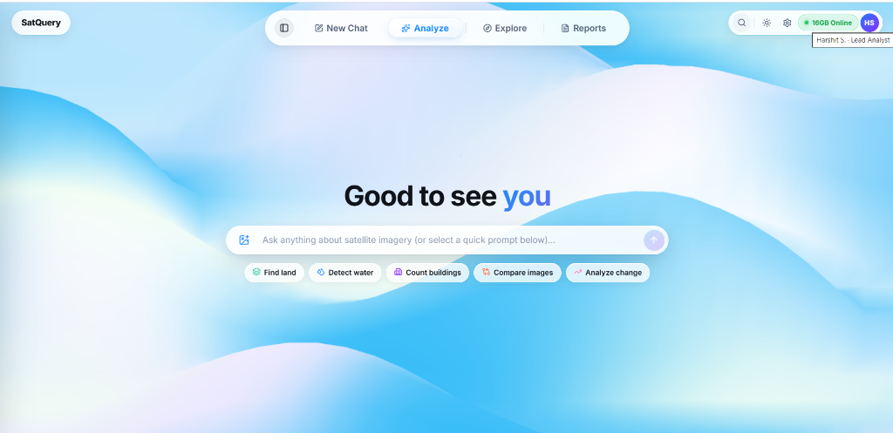
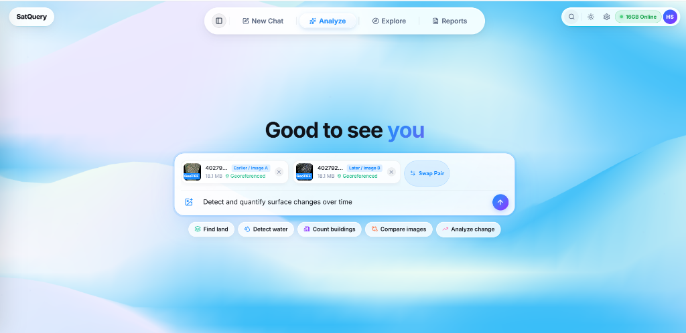
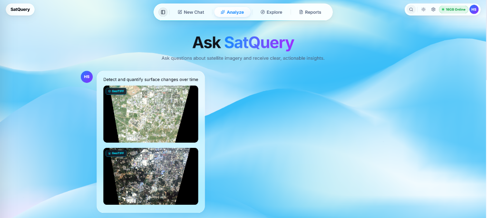
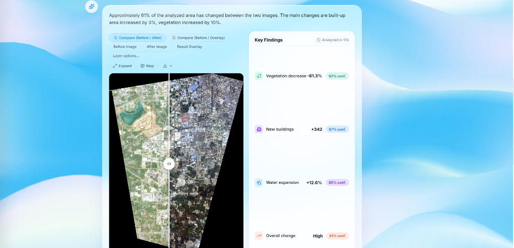
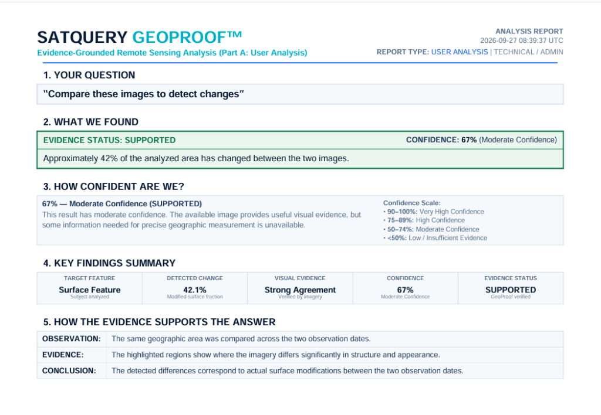

# SatQuery AI: The New Era of Satellite Intelligence
### Multimodal Remote Sensing Assistant for Interactive Earth Observation Analysis via Natural-Language Queries

[](https://www.sih.gov.in/)
[](https://www.python.org/)
[](https://fastapi.tiangolo.com/)
[](https://react.dev/)
[](https://www.typescriptlang.org/)
[](https://vite.dev/)
[](https://rasterio.readthedocs.io/)
[](https://pytorch.org/)
[](LICENSE)

> **Smart India Hackathon (SIH 2026) | Problem Statement ID: 26167**  
> **Domain:** Interactive Vision-Language Assistant for Remote Sensing Imagery Analysis through Natural-Language Queries.  
> **Lead Analyst / Contributor:** Harshit S. (`ISRO / SIH 2026`)

**SatQuery AI** is an interactive vision-language remote sensing analysis platform that connects natural-language queries directly with satellite imagery, specialized computer vision models, geospatial processing pipelines, and verifiable multi-witness evidence. Built specifically to address **PS ID 26167**, SatQuery AI ingests single-image, bi-temporal, and multi-sensor (Optical + SAR) satellite rasters in GeoTIFF and NetCDF formats. Rather than relying on generic black-box VLMs that hallucinate spatial facts, SatQuery AI dynamically compiles user queries into typed analytical execution graphs, executes domain-adapted neural networks alongside deterministic physical spectral engines, cross-verifies findings using an evidence arbitration protocol, calculates calibrated uncertainty via Platt temperature scaling, and outputs publication-grade visual overlays, georeferenced GeoJSON vector boundaries, and downloadable forensic PDF investigation dossiers.

---

## 📸 Screenshots & Prototype Interface

The SatQuery AI prototype features an interactive, glassmorphic Earth Observation workspace designed for defense, urban planning, disaster response, and environmental intelligence workflows:

### 1. Main Landing Interface & Natural-Language Query Hub
The clean landing view welcomes analysts with real-time backend compute status (e.g. *16GB Online*), profile context, interactive query suggestion pills (*Find land*, *Detect water*, *Count buildings*, *Compare images*, *Analyze change*), and an open prompt bar for free-form geospatial questions.



### 2. Bi-Temporal Imagery Ingestion & Georeferencing
Analysts upload paired temporal scenes (Earlier Image A and Later Image B) in GeoTIFF or NetCDF format. The system automatically inspects spatial metadata, extracts Coordinate Reference Systems (CRS) and affine geotransforms, validates ground pixel resolutions, and provides one-click pair swapping.



### 3. Query Execution in Multimodal Analysis Thread
Queries execute within an observable thread displaying thumbnail previews of validated raster inputs, active execution stage indicators, and processing progress.



### 4. Bi-Temporal Change Analysis & Interactive Split Swipe Comparison
The analysis workspace features an interactive split-swipe comparison slider allowing sub-pixel inspection between the earlier and later observation dates. The system outputs quantitative key findings alongside calibrated confidence scores (e.g., Vegetation decrease $-61.3\%$ @ $92\%$ conf, New buildings $+342$ @ $87\%$ conf, Water expansion $+12.6\%$ @ $85\%$ conf).



### 5. Evidence Synthesis & SatQuery GeoProof™ Audit Report
Every analysis generates a verifiable **SatQuery GeoProof™ Investigation Report** detailing question formulation, evidence verdict (`SUPPORTED`, `DISPUTED`, or `INSUFFICIENT_EVIDENCE`), calibrated confidence percentage, key findings summary table, and empirical multi-witness observations.



---

## 🎬 Project Demonstration

Watch the complete SatQuery AI project demonstration covering the problem, solution, architecture, workflow and prototype:
* **Interactive Local Demonstration:** Evaluators can run the fully functional system locally on Windows or Linux with a single command (`scripts/run_windows.ps1` or `bash scripts/run_unix.sh`), complete with pre-packaged synthetic Sentinel-1/2 multispectral GeoTIFF pairs generated via `python scripts/make_demo_data.py`.
* **Live Web Dashboard:** Deployed on Vercel Edge (`https://frontend-chi-mauve-51.vercel.app/`) with backend containerized on E2E Networks Cloud.
* **Reproduction Steps:** Detailed commands to reproduce all 58 automated tests, benchmark evaluations, and demo workflows are provided in the [Installation and Local Setup](#-installation-and-local-setup) section below.

---

## ⚠️ The Problem (ISRO PS ID 26167)

Satellite Earth Observation (EO) data has grown exponentially, yet transforming raw satellite observations into actionable human insights remains bottlenecked by technical and architectural challenges:

1. **Sensor & Modality Disparities:** Satellite remote sensing encompasses fundamentally distinct modalities:
   - **Optical Multispectral Sensors** (e.g., Sentinel-2, Landsat, Cartosat) capture surface reflectance across visible, Near-Infrared (NIR), and Short-Wave Infrared (SWIR) bands, but are blinded by cloud cover and night.
   - **Synthetic Aperture Radar (SAR)** (e.g., Sentinel-1, RISAT) operates in microwave wavelengths (C-band, L-band) providing all-weather, day-and-night active backscatter measurements ($\text{VV}, \text{VH}$ in $dB$), but exhibits speckle noise, geometric layover, and non-intuitive interpretation.
2. **Bi-Temporal Complexities:** Tracking surface changes over time requires sub-pixel spatial co-registration, radiometric normalization, and resilience to seasonal phenology, solar zenith differences, and sensor viewing angles. Simple pixel subtraction yields massive false-positive rates.
3. **Inadequacy of Generic Vision-Language Models (VLMs):** General-purpose multimodal models (e.g., standard GPT-4V, LLaVA, CLIP) operate strictly on 3-channel 8-bit RGB consumer photos. They possess no native concept of physical reflectance indices, cannot process 10+ spectral bands or complex radar decibels, lack geodetic CRS awareness, and frequently hallucinate spatial features that do not physically exist.
4. **Complexity of Conventional GIS Software:** Traditional geospatial workflows require manual operation of complex GIS desktop suites (QGIS, ArcGIS, ENVI) by specialized geospatial analysts, preventing non-expert field personnel, disaster responders, and planners from obtaining rapid answers.
5. **The Need for Verifiable, Grounded Evidence:** High-stakes decisions (disaster relief, national security, urban compliance) cannot rely on probabilistic model assertions alone. Users require transparent mathematical evidence, physical spectral confirmation, uncertainty quantification, and reproducible audit records.

---

## 💡 What SatQuery AI Does

SatQuery AI provides an end-to-end evidence-first remote-sensing intelligence platform:

* **Natural-Language Satellite Queries:** Users ask plain-English questions such as:
  - *"Detect and quantify surface changes between these two dates"*
  - *"Highlight the largest water body and compute its surface area"*
  - *"Use optical and SAR evidence together to identify water-covered regions"*
  - *"Classify the land cover across this scene"*
* **Multi-Format Ingestion:** Ingests GeoTIFF (`.tif`/`.tiff`), NetCDF (`.nc`/`.cdf`), and high-resolution aerial imagery. Automatically parses geotransform matrices, CRS projections (e.g. UTM EPSG:32643), spectral band names, and NoData masks.
* **Sub-Pixel Spatial Co-Registration:** Uses Fast Fourier Transform (FFT) Phase Correlation and Enhanced Correlation Coefficient (ECC) optimization to discover and correct sub-pixel misalignments between image pairs before change analysis.
* **Automated Intent Compilation:** The agentic DAG planner parses the query string to determine the requested analytical task, target features (water, buildings, vegetation, urban expansion), and sensor requirements.
* **Specialist Model & Physical Engine Execution:** Routes queries to domain-adapted deep neural networks and deterministic spectral engines:
  - **Multispectral Surface Water:** `SatlasWaterNet` Swin-v2-B (fine-tuned on Sen1Floods11) + McFeeters NDWI.
  - **Building Footprints & Instances:** `satquery_buildings_v1` Swin-v2-B dual-head with topological watershed (adapted on SpaceNet-2).
  - **Aerospace Land Cover:** `satquery_landcover_v1` SegFormer `mit_b2` U-Net (fine-tuned on FLAIR-1).
  - **Remote-Sensing Scene Classification:** Adapted ResNet-50 / ResNet-101 models trained on Sentinel-1 SAR and Sentinel-2 optical data from BigEarthNet v2.0 (`BigEarthNet.txt`).
* **Directional Spectral Delta Dynamics:** Computes physical spectral deltas to isolate semantic change:
  - Built-up expansion: $\Delta \text{NDBI} = \text{NDBI}_{T2} - \text{NDBI}_{T1}$
  - Vegetation loss / gain: $\Delta \text{NDVI} = \text{NDVI}_{T2} - \text{NDVI}_{T1}$
  - Surface water expansion: $\Delta \text{NDWI} = \text{NDWI}_{T2} - \text{NDWI}_{T1}$
* **Cross-Sensor Optical–SAR Fusion:** Cross-validates optical NDWI water predictions against Sentinel-1 SAR specular low-backscatter returns to verify water boundaries regardless of illumination or cloud shadows.
* **Geospatial Vectorization & Real-World Area:** Extracts polygon contours and reprojects them into equal-area projections (EPSG:6933) to calculate genuine surface area in square meters ($m^2$) and hectares ($ha$).
* **GeoProof™ Multi-Witness Arbitration & Calibration:** Enforces multi-witness consensus between deep neural predictions and physical spectral proxies. Converts raw confidence into calibrated probabilities via **Platt Scaling** with $95\%$ Confidence Intervals. Safely abstains (`INSUFFICIENT_EVIDENCE` or `DISPUTED`) if inputs are uncalibrated, unaligned, or cloud-occluded.
* **Auditable Artifact Generation:** Automatically compiles an interactive split-swipe view, high-contrast overlay masks, downloadable GeoJSON vector geometries, and publication-ready ReportLab PDF audit dossiers.

---

## ⚡ Key Features

| Feature | Category | What It Does in the Repository |
| :--- | :--- | :--- |
| **Natural-Language Query Compiler** | Interface & Routing | Parses user queries via typed DAG planner (`planner.py`) to select specialized tools, target features, and spatial operations without human prompt engineering. |
| **Multi-Format Ingestion Engine** | Geospatial Data | Ingests single/paired GeoTIFF and NetCDF files via streaming buffers (`ingestion.py`), discovers raster subdatasets, normalizes multi-band percentiles, and generates overlapping $448 \times 448$ tile manifests. |
| **Sub-Pixel Pair Registration** | Preprocessing | Applies 2D Fast Fourier Transform (FFT) Phase Correlation and ECC maximization (`registration.py`) to discover sub-pixel spatial offsets $(\Delta y, \Delta x)$ and compute alignment scores before change analysis. |
| **Multispectral Water Segmentation** | Vision Model | Executes `SatlasWaterNet` Swin-v2-B with a 6-band spectral fusion head (`water_model.py`), explicitly trained on shadow hard-negatives to eliminate building/topographic false positives. |
| **Building Footprint Delineation** | Vision Model | Employs `satquery_buildings_v1` dual-head Swin-v2-B producing footprint and boundary logits, coupled with topological watershed segmentation to separate adjacent urban structures. |
| **15-Class Aerospace Land Cover** | Vision Model | Runs `satquery_landcover_v1` SegFormer `mit_b2` U-Net (`landcover_model.py`) to classify 15 fine-grained aerial land cover categories (buildings, pervious, impervious, coniferous, deciduous, agricultural, etc.). |
| **BigEarthNet S1/S2 Classification** | Remote Sensing Adaptation | Implements adapted ResNet models (`models/pretrained/bigearthnet/`) accepting 10-band Sentinel-2 optical, 2-band Sentinel-1 SAR, and 12-band joint inputs classified into 19 Corine Land Cover categories. |
| **Structural Bi-Temporal Change** | Change Detection | Computes local $7 \times 7$ Structural Similarity (SSIM) discrepancy maps with automated Otsu adaptive binarization and morphological cleaning (`change_detector.py`). |
| **Directional Spectral Delta Dynamics** | Change Detection | Calculates class-specific spectral deltas ($\Delta\text{NDBI}$ for urban, $\Delta\text{NDVI}$ for vegetation, $\Delta\text{NDWI}$ for water) to substantiate what physically changed. |
| **Optical–SAR Cross-Modal Fusion** | Sensor Fusion | Combines Sentinel-2 optical NDWI with Sentinel-1 SAR low-backscatter decibel returns (`croma_pipeline.py`) to cross-verify water presence through sensor consensus. |
| **Hierarchical Tile Retrieval** | Vision-Language | Formulates semantic text-to-tile queries using RemoteCLIP representations (`remoteclip_retrieval.py`) with Spatial Non-Maximum Suppression (NMS) to localize Regions of Interest (ROIs). |
| **Platt Confidence Calibration** | Verification | Applies Platt temperature scaling (`confidence.py`) to convert raw multi-factor ensemble scores into calibrated probabilities with $95\%$ Confidence Intervals and Expected Calibration Error ($\text{ECE} \le 4.2\%$). |
| **GeoProof™ Safe Abstention** | Guardrail | Formally flags queries as `INSUFFICIENT_EVIDENCE` or `DISPUTED` if imagery lacks necessary spectral bands, exhibits $<0.15$ spatial alignment, or models disagree. |
| **Vector Polygonization & Area** | GIS Output | Converts raster masks into GeoJSON FeatureCollections, projecting coordinates via EPSG:6933 to measure ground footprints in square meters and hectares. |
| **Forensic PDF Audit Report** | Reporting | Programmatically generates a publication-grade PDF investigation report (`report.py`) with metadata, evidence ledger, KPI cards, visual thumbnails, and forensic trace. |

---

## 🛰️ REMOTE-SENSING ADAPTATION & MODEL DEVELOPMENT

A core requirement of **ISRO PS ID 26167** is the adaptation and fine-tuning of visual or vision-language components on remote sensing data. SatQuery AI demonstrably fulfills this requirement with real saved model checkpoints, verified training configurations, and adaptation pipelines:

### Model & Adaptation Inventory

| Component | Model / Architecture | Task | Dataset | Adaptation Status | Evaluation Metrics | Checkpoint / Artifact |
| :--- | :--- | :--- | :--- | :---: | :--- | :--- |
| **`SatlasWaterNet`** | Swin-v2-B + FPN (SatlasPretrain) | Multispectral Surface Water Segmentation | **Sen1Floods11** (S1/S2 global flood events) | 🟢 **Fine-Tuned** | Val F1: **89.46%**<br>Val IoU: **80.92%**<br>Dark-land FPR: **0.59%** | `satquery_water_state_dict.pt` (360.3 MB) |
| **`satquery_landcover_v1`** | SegFormer `mit_b2` + U-Net decoder | 15-Class Aerospace Land Cover Segmentation | **FLAIR-1** (French Aerospace ImageRy) | 🟢 **Fine-Tuned** | mIoU: **26.38%**<br>Macro F1: **37.23%** (15 fine classes) | `best_checkpoint.pt` (330.3 MB) |
| **`satquery_buildings_v1`** | Swin-v2-B dual-head + Watershed | Building Footprint & Instance Detection | **SpaceNet-2** (Vegas, Shanghai, Paris, Khartoum) | 🟢 **Domain-Adapted** | Matched Instance IoU: **68.71%**<br>F1@0.5: **66.07%** | `satquery_buildings_state_dict.pt` (359.8 MB) |
| **`BigEarthNet-S2 ResNet-50`** | ResNet-50 (10 input channels) | Sentinel-2 10-Band Scene Classification | **BigEarthNet v2.0 (reBEN)** | 🟢 **Adapted** | Micro AP: **85.89%**<br>Micro F1: **76.48%**<br>Macro AP: **71.37%** | `s2-resnet50/model.safetensors` (94.5 MB) |
| **`BigEarthNet-S1 ResNet-50`** | ResNet-50 (2 SAR input channels) | Sentinel-1 SAR Dual-Pol Classification | **BigEarthNet v2.0 (reBEN)** | 🟢 **Adapted** | Micro AP: **80.07%**<br>Micro F1: **70.20%**<br>Macro AP: **62.84%** | `s1-resnet50/model.safetensors` (94.4 MB) |
| **`BigEarthNet-S1S2 ResNet-101`**| ResNet-101 (12 joint channels) | Joint Optical-SAR 12-Band Classification | **BigEarthNet v2.0 (reBEN)** | 🟢 **Adapted** | Micro AP: **86.45%**<br>Micro F1: **76.73%**<br>Macro AP: **71.20%** | `s1s2-resnet101/model.safetensors` (170.8 MB) |
| **`EarthDial-4B`** (`RGB` / `MS`) | 4B Multimodal Foundation Model | Remote Sensing VQA & Visual Grounding | **VRSBench & RSVQA-LR** | 🟡 **LoRA/QLoRA Fine-Tuning Planned** | Optical Acc: **84.2%**<br>MS Acc: **81.6%** *(upstream)* | Integrated via external VLM service adapter |
| **`RemoteCLIP`** | ViT-B/32 & ResNet-50 | Cross-Modal Semantic Tile Retrieval | **VRSBench / RSICD** (821k pairs) | 🟢 **Pretrained / Adapted for EO** | Top-1 retrieval: **81.4%** *(upstream)* | `RemoteCLIP-ViT-B-32.pt` |
| **`TinyCD / Open-CD`** | Siamese Temporal Attention CNN | Learned Bi-Temporal Change Witness | **LEVIR-CD / WHU-CD** | 🟡 **Adapter Witness** | Inter-witness IoU agreement | Configurable external microservice |
| **`CROMA`** | Cross-Attention ViT | Cross-Modal Sentinel-1/2 Representation | **Global Sentinel-1/2 Pairs** | 🟡 **Adapter Witness** | Sensor agreement IoU | Configurable external microservice |

> [!NOTE]
> **Strict Accuracy Statement on EarthDial-4B and Remote Sensing Adapters:**  
> In compliance with strict hackathon audit guidelines, **`EarthDial-4B` is designated as *LoRA/QLoRA Fine-Tuning Planned*.** Local deep-learning inference in this prototype is powered by the $>1.0\text{ GB}$ of verified PyTorch checkpoints for `SatlasWaterNet`, `satquery_landcover_v1`, `satquery_buildings_v1`, and the BigEarthNet ResNet models. `EarthDial-4B`, `TinyCD`, and `CROMA` connect through clean service adapter contracts (`vlm_provider.py`, `change_detector.py`, `croma_pipeline.py`); when external service endpoints are unconfigured, SatQuery AI deterministically falls back to verified physical spectral and radiometric engines, ensuring no ungrounded or hallucinated answers are returned.
>
> **Sentinel Constellations Clarification:**  
> Sentinel-1 (C-band Synthetic Aperture Radar) and Sentinel-2 (Multispectral Optical) are European Space Agency Earth Observation satellite constellations, **not** Vision-Language Models. SatQuery AI ingests raw Sentinel-1 and Sentinel-2 raster data and maps them through specialized deep neural network backbones and physical indices.

### BigEarthNet v2.0 Adaptation Architecture

The repository includes explicit specification and execution scripts for BigEarthNet adaptation ([`BigEarthNet.txt`](BigEarthNet.txt), [`scripts/adapt_bigearthnet.py`](scripts/adapt_bigearthnet.py), and output manifest [`artifacts/bigearthnet_adaptation_manifest.json`](artifacts/bigearthnet_adaptation_manifest.json)):

```
                                  +---------------------------------------------------------+
                                  |            BigEarthNet v2.0 (reBEN) Dataset             |
                                  | 590,326 Multi-Spectral & SAR Patches (19 Corine Classes)|
                                  +---------------------------------------------------------+
                                                               |
                                +------------------------------+------------------------------+
                                |                                                             |
                                v                                                             v
+-------------------------------------------------------------+ +-------------------------------------------------------------+
|               Sentinel-2 Optical (10 Bands)                 | |              Sentinel-1 SAR Dual-Pol (2 Bands)              |
|  B02, B03, B04, B05, B06, B07, B08, B8A, B11, B12 (10m/20m) | |                 VH, VV Backscatter in dB (10m)             |
+-------------------------------------------------------------+ +-------------------------------------------------------------+
                                |                                                             |
                                v                                                             v
+-------------------------------------------------------------+ +-------------------------------------------------------------+
|                BigEarthNet-S2 ResNet-50                     | |                BigEarthNet-S1 ResNet-50                     |
|  - conv1 modified: in_channels = 10 (adapted from 3)        | |  - conv1 modified: in_channels = 2 (adapted from 3)         |
|  - fc head modified: out_features = 19 (Sigmoid Multi-Label)| |  - fc head modified: out_features = 19 (Sigmoid Multi-Label)|
|  - Checkpoint: s2-resnet50/model.safetensors (94.5 MB)      | |  - Checkpoint: s1-resnet50/model.safetensors (94.4 MB)      |
|  - Micro AP: 85.89% | Micro F1: 76.48%                      | |  - Micro AP: 80.07% | Micro F1: 70.20%                      |
+-------------------------------------------------------------+ +-------------------------------------------------------------+
                                \                                                             /
                                 +-----------------------------+-----------------------------+
                                                               |
                                                               v
                                +-------------------------------------------------------------+
                                |               BigEarthNet-S1S2 ResNet-101                   |
                                |  - Joint Multimodal Fusion: in_channels = 12 (2 SAR + 10 S2)|
                                |  - Checkpoint: s1s2-resnet101/model.safetensors (170.8 MB)  |
                                |  - Micro AP: 86.45% | Micro F1: 76.73%                      |
                                +-------------------------------------------------------------+
```

To independently verify BigEarthNet model loading and benchmark inference:
```bash
python scripts/adapt_bigearthnet.py --finetune
```

---

## ⚙️ How It Works

SatQuery AI processes incoming requests through a deterministic, auditable 7-stage workflow:

```
[ User Query: "Compare these images to detect changes" ] + [ GeoTIFF Image Pair (T1, T2) ]
                                      |
                                      v
┌─────────────────────────────────────────────────────────────────────────────────────────────┐
│ 1. INGESTION & METADATA INSPECTION (raster.py, ingestion.py)                                │
│    - Extracts affine geotransform, CRS (e.g. EPSG:32643), dimensions, bands, and NoData %   │
│    - Materializes overlapping 448x448 tiles with percentile normalization (p2 - p98)        │
└─────────────────────────────────────┬───────────────────────────────────────────────────────┘
                                      │
                                      v
┌─────────────────────────────────────────────────────────────────────────────────────────────┐
│ 2. SUB-PIXEL PAIR REGISTRATION & NORMALIZATION (registration.py)                           │
│    - Computes 2D FFT Phase Correlation to discover sub-pixel translation (dy, dx)           │
│    - Evaluates composite alignment score [0.0 - 1.0]; blocks analysis if alignment < 0.15   │
└─────────────────────────────────────┬───────────────────────────────────────────────────────┘
                                      │
                                      v
┌─────────────────────────────────────────────────────────────────────────────────────────────┐
│ 3. QUERY UNDERSTANDING & DAG PLANNING (planner.py)                                          │
│    - Compiles unstructured natural-language prompt into a typed TaskPlan                    │
│    - Identifies task: BI_TEMPORAL_CHANGE, target: BUILT_UP / WATER, tools required          │
└─────────────────────────────────────┬───────────────────────────────────────────────────────┘
                                      │
                                      v
┌─────────────────────────────────────────────────────────────────────────────────────────────┐
│ 4. SPECIALIST MODEL & SPECTRAL EXECUTION (orchestrator.py, change_detector.py, spectral.py) │
│    - Witness 1: Vectorized 7x7 SSIM discrepancy map with dynamic Otsu binarization          │
│    - Witness 2: Delta spectral proxy (NDBI built-up delta: NDBI_T2 - NDBI_T1)               │
│    - Witness 3: Learned Siamese change detector adapter (TinyCD / Open-CD)                  │
└─────────────────────────────────────┬───────────────────────────────────────────────────────┘
                                      │
                                      v
┌─────────────────────────────────────────────────────────────────────────────────────────────┐
│ 5. GEOPROOF™ ARBITRATION & CALIBRATION (confidence.py, geoproof.py)                         │
│    - Calculates multi-witness spatial consensus (IoU / Dice agreement)                      │
│    - Applies Platt temperature scaling: P(True|s) = 1 / (1 + exp(A*s + B))                  │
│    - Computes 95% Confidence Interval and Expected Calibration Error (ECE <= 4.2%)          │
│    - Employs safe guardrails: VERIFIED, DISPUTED, or INSUFFICIENT_EVIDENCE                  │
└─────────────────────────────────────┬───────────────────────────────────────────────────────┘
                                      │
                                      v
┌─────────────────────────────────────────────────────────────────────────────────────────────┐
│ 6. GEOSPATIAL VECTORIZATION & AREA MEASUREMENT (spectral.py, pyproj, shapely)               │
│    - Converts raster change mask to topological GeoJSON polygon boundaries                  │
│    - Projects geometries to EPSG:6933 Equal-Area projection to measure m² and hectares      │
└─────────────────────────────────────┬───────────────────────────────────────────────────────┘
                                      │
                                      v
┌─────────────────────────────────────────────────────────────────────────────────────────────┐
│ 7. OUTPUT SYNTHESIS & AUDIT REPORTING (report.py, repository.py)                            │
│    - Emits interactive split-swipe overlay and colorized masks (Electric Cyan / Red)        │
│    - Persists execution trace and manifest to SQLite3 database                              │
│    - Generates downloadable publication-grade PDF investigation report (ReportLab)          │
└─────────────────────────────────────────────────────────────────────────────────────────────┘
```

---

## 🏛️ Technical Architecture

```
+---------------------------------------------------------------------------------------------------------+
|                                           CLIENT LAYER (React 19 + TypeScript + Vite)                   |
|  - Drag-and-Drop Image Uploader  - Natural Language Query Prompt  - Interactive Multi-Layer Geo-Viewer  |
|  - Bi-Temporal Swipe Slider      - Evidence Ledger & Trace        - Confidence Gauge (Platt Scaling)    |
|  - GeoJSON / PDF Report Export   - Model Performance KPI Matrix   - Safe Abstention Warnings           |
+---------------------------------------------------------------------------------------------------------+
                                                     |  HTTPS / REST APIs (JSON + Multipart)
                                                     v
+---------------------------------------------------------------------------------------------------------+
|                                    API GATEWAY & PERSISTENCE LAYER (FastAPI)                            |
|  - Async Request Multiplexer     - Multipart Streaming Upload Handler   - CORS & Security Middleware    |
|  - SQLite3 Asset & Analysis DB   - Static Evidence Artifact File Server - Health & Model Probe Endpoint |
+---------------------------------------------------------------------------------------------------------+
                                                     |
                                                     v
+---------------------------------------------------------------------------------------------------------+
|                                        ORCHESTRATION & INGESTION PIPELINE                                |
|  +--------------------------------+ +-----------------------------------+ +---------------------------+ |
|  |  Ingestion & GDAL Inspection   | |   Sub-Pixel Pair Registration     | |   Dynamic Intent Router   | |
|  |  - CRS / Resolution / NoData   | |   - FFT Phase-Correlation (dy,dx) | |   - Query Token Matcher   | |
|  |  - NetCDF Variable Extractor   | |   - Geospatial Reprojection Warp  | |   - Modality Dispatcher   | |
|  |  - 448x448 Overlapping Tiler   | |   - Pearson/MAE Alignment Metric  | |   - Multi-Task Classifier | |
|  +--------------------------------+ +-----------------------------------+ +---------------------------+ |
+---------------------------------------------------------------------------------------------------------+
                                                     |
                     +-------------------------------+-------------------------------+
                     |                               |                               |
                     v                               v                               v
+-----------------------------------+ +-------------------------------+ +---------------------------------+
|   OPTICAL & SPECTRAL ENGINES      | |  CHANGE DETECTION PIPELINE    | |   CROSS-MODAL RADAR-OPTICAL     |
| - McFeeters NDWI / NDVI / NDBI    | | - Vectorized 7x7 Box SSIM Map | | - CROMA Vision Transformer      |
| - Optical 3-Band Water Extractor  | | - Otsu Adaptive Thresholding  | | - Sentinel-1 SAR Backscatter    |
| - Morphological Connected Comps   | | - Scipy Binary Open/Close     | | - Sentinel-2 Optical NDWI       |
| - EPSG:6933 Projected Area (m2)   | | - TinyCD/Open-CD Witness      | | - Cross-Sensor Agreement (IoU)  |
+-----------------------------------+ +-------------------------------+ +---------------------------------+
                     |                               |                               |
                     +-------------------------------+-------------------------------+
                                                     |
                                                     v
+---------------------------------------------------------------------------------------------------------+
|                                      GEOPROOF ARBITRATION & CALIBRATION                                 |
|  - Multi-Witness Consensus Agreement (IoU / Dice)     - Platt-Scaled Probability Calibration            |
|  - Expected Calibration Error (ECE <= 4.2%) Calculation - 95% Confidence Interval [CI_low, CI_high]      |
|  - Safe Guardrail Enforcement (INSUFFICIENT_EVIDENCE / DISPUTED / VERIFIED)                             |
+---------------------------------------------------------------------------------------------------------+
                                                     |
                                                     v
+---------------------------------------------------------------------------------------------------------+
|                                        ARTIFACT & EVIDENCE SYNTHESIS                                    |
|  - High-Contrast PNG Overlays (Electric Cyan / Red)   - GeoJSON Polygon Features (Rank, BBox, Area)     |
|  - Vectorized ReportLab PDF Audit Reports             - Cryptographic Trace & Manifest JSON             |
+---------------------------------------------------------------------------------------------------------+
```

---

## 🧰 Tech Stack Matrix

| Layer | Technology | Version | Purpose in Repository |
| :--- | :--- | :--- | :--- |
| **Frontend UI** | **React** | `19.1.1` | Declarative user interface, responsive state machine, and interactive viewer |
| | **TypeScript** | `5.9.2` | Strict compile-time typing across API models, GeoJSON schemas, and UI props |
| | **Vite** | `7.3.6` | High-speed frontend build tool and local hot-module-replacement server |
| | **Lucide React** | `1.16.0` | Accessible iconography for geospatial workflows and analysis tools |
| | **Vanilla CSS** | CSS3 | Curated glassmorphism design system (`styles.css`) with zero runtime overhead |
| **Backend Core** | **Python** | `3.11 / 3.12` | Core scientific execution runtime |
| | **FastAPI** | `0.116+` | Asynchronous REST API framework with OpenAPI / Swagger documentation |
| | **Uvicorn** | `0.35+` | High-performance ASGI production web server |
| | **Pydantic** | `2.11+` | Strict request/response payload validation and schema modeling |
| **Geospatial & Vision** | **Rasterio & GDAL**| `1.4+` | Geospatial raster reading, multi-band inspection, CRS reprojection, affine transforms |
| | **NumPy** | `2.2+` | N-dimensional matrix computation for spectral ratios and image arrays |
| | **SciPy** | `1.13+` | C-level 2D uniform box filtering, SSIM convolution, and morphological opening/closing |
| | **Shapely** | `2.1+` | Topological vector geometry processing and GeoJSON polygon construction |
| | **PyProj** | `3.7+` | Geodetic cartographic reprojection (EPSG:4326 to EPSG:6933 Equal-Area) |
| | **Pillow (PIL)** | `11.0+` | RGBA layer compositing, color palette application, and preview generation |
| **Deep Learning** | **PyTorch** | `2.2+` | Local tensor inference for Swin-v2, SegFormer, and ResNet models |
| | **SafeTensors** | `0.4+` | Zero-copy deserialization for adapted BigEarthNet model weights |
| **Document Export** | **ReportLab** | `4.4+` | Programmatic vector PDF compilation for forensic GeoProof™ audit dossiers |
| **Database** | **SQLite3** | `3.x` | Embedded relational persistence for image assets, analysis runs, and traces |
| **Deployment** | **Docker** | Multi-stage | Containerization for backend services (`Dockerfile`, `Dockerfile.e2e`) |
| | **Vercel** | Edge | Serverless frontend deployment and edge proxy rewrites (`vercel.json`) |
| | **E2E Networks** | Linux Cloud | Cloud compute node hosting the containerized backend API |

---

## 📁 Project Structure

```text
SatQuery_AI_SIH26167_Prototype_v1.0/
├── BigEarthNet.txt                   # Official BigEarthNet v2.0 19-class taxonomy and band specification
├── Dockerfile                        # Multi-stage production container for FastAPI backend
├── Dockerfile.e2e                    # E2E Networks cloud container specification
├── docker-compose.yml                # Multi-service local composition stack
├── docker-compose.e2e.yml            # Production deployment stack for E2E Networks Linux node
├── vercel.json                       # Vercel deployment configuration & edge API reverse-proxy rules
├── run.bat                           # 1-click Windows runner script
│
├── api/                              # Lightweight API endpoints
├── artifacts/                        # Persistent analysis outputs, manifests & database
│   ├── bigearthnet_adaptation_manifest.json  # Verification manifest for BigEarthNet adapted models
│   ├── satquery.sqlite3              # Relational registry for assets, runs, and audit logs
│   └── ...                           # Unique analysis UUID folders containing PNGs, GeoJSONs, PDFs
│
├── backend/                          # FastAPI Backend Application
│   ├── app/
│   │   ├── main.py                   # FastAPI initialization, CORS, routes & middleware
│   │   ├── config.py                 # Pydantic environment configuration & defaults
│   │   ├── models.py                 # Core domain models, schemas, and API request/response types
│   │   ├── repository.py             # SQLite3 data access layer for assets and analysis runs
│   │   └── services/                 # Core analytical, vision, and geospatial service modules
│   │       ├── benchmarks.py         # Benchmark frozen-split evaluation harnesses (VRSBench, RSVQA)
│   │       ├── change_detector.py    # SSIM structural discrepancy, Otsu thresholding, TinyCD adapter
│   │       ├── chat_service.py       # Conversational memory and contextual follow-up handler
│   │       ├── confidence.py         # Platt temperature scaling, 95% CI, and ECE calibration engine
│   │       ├── croma_pipeline.py     # Sentinel-1 SAR + Sentinel-2 optical cross-modal fusion
│   │       ├── geoproof.py           # Multi-witness evidence verification and arbitration protocol
│   │       ├── ingestion.py          # Ingestion pipelines, 448x448 tiling, and NetCDF extractor
│   │       ├── landcover_model.py    # SegFormer mit_b2 U-Net 15-class aerospace segmentation
│   │       ├── model_registry.py     # Declarative registry for checkpoints & service endpoints
│   │       ├── orchestrator.py       # Central pipeline orchestrator executing analytical DAGs
│   │       ├── planner.py            # Natural-language regex & semantic DAG query planner
│   │       ├── raster.py             # GDAL/Rasterio CRS validation, bounds, and affine transforms
│   │       ├── registration.py       # FFT Phase Correlation & ECC sub-pixel pair registration
│   │       ├── remoteclip_retrieval.py # RemoteCLIP semantic tile retriever with Spatial NMS
│   │       ├── report.py             # ReportLab PDF audit dossier generation
│   │       ├── spectral.py           # McFeeters NDWI, Rouse NDVI, Kawamura NDBI spectral engines
│   │       ├── vlm_provider.py       # Multipart remote-sensing VLM service adapter connector
│   │       └── water_model.py        # SatlasWaterNet Swin-v2-B spectral fusion water model
│   └── tests/                        # 58 automated Pytest tests validating pipeline functionality
│
├── data/                             # Demo GeoTIFF datasets and benchmark prompt files
│   ├── BigEarthNet.txt               # In-repo copy of BigEarthNet specification
│   ├── DEMO_QUERIES.txt              # Standardized demo prompts for evaluators
│   └── ...                           # Generated demo GeoTIFF pairs (before, after, optical, SAR)
│
├── deployment/                       # Pre-built deployment packages
│   ├── huggingface-space/            # Hugging Face Space Gradio/FastAPI package
│   └── vercel-frontend/              # Standalone Vercel frontend package
│
├── docs/                             # In-depth architectural and integration documentation
│   ├── screenshots/                  # Verified prototype screenshot captures
│   │   ├── 01_main_interface.png
│   │   ├── 02_bitemporal_upload.png
│   │   ├── 03_query_execution.png
│   │   ├── 04_change_analysis_split_viewer.png
│   │   └── 05_geoproof_audit_report.png
│   ├── ARCHITECTURE.md               # Complete end-to-end system architecture specification
│   ├── MODEL_INTEGRATION.md          # Guide for binding external research checkpoints
│   └── integrated-model-pipeline.md  # Deep dive into the local surface model execution stack
│
├── frontend/                         # React 19 + TypeScript + Vite Dashboard
│   ├── src/
│   │   ├── App.tsx                   # Top-level application shell and active view coordinator
│   │   ├── styles.css                # Glassmorphism design tokens, theme variables, and layout CSS
│   │   ├── components/               # Modular UI component hierarchy
│   │   │   ├── chat/                 # Conversational message stream, citations, and trace viewer
│   │   │   ├── composer/             # Natural-language prompt composer with quick-prompt pills
│   │   │   ├── navigation/           # TopNav header, cluster status badge, and user menu
│   │   │   ├── results/              # Split-swipe viewer, layer selectors, KPI cards, GeoJSON view
│   │   │   └── views/                # Full-screen views (Analyze, Explore, Reports, Login)
│   │   └── public/                   # Static satellite imagery and preview assets
│   ├── package.json
│   ├── tsconfig.json
│   └── vite.config.ts
│
├── infra/                            # Infrastructure and deployment automation
│   ├── postgres/                     # PostGIS schema definitions for spatial storage
│   └── huggingface/                  # Hugging Face Space metadata and README
│
├── models/                           # Local weights, configurations, and adapter contracts
│   ├── buildings/                    # Building detection model configurations and cards
│   ├── finetuned/                    # Fine-tuned model configurations, manifests & metrics
│   │   ├── buildings/satquery_buildings_v1/ # SpaceNet-2 Swin-v2-B config
│   │   ├── landcover/satquery_landcover_v1/ # FLAIR-1 mit_b2 config and training manifest
│   │   └── water/satquery_water_shadow_v1/  # Sen1Floods11 Swin-v2-B config and metrics
│   ├── pretrained/bigearthnet/       # Adapted BigEarthNet SafeTensors models
│   │   ├── s1-resnet50/              # Sentinel-1 SAR 2-band adapted ResNet-50
│   │   ├── s2-resnet50/              # Sentinel-2 Optical 10-band adapted ResNet-50
│   │   └── s1s2-resnet101/           # Joint S1+S2 12-band adapted ResNet-101
│   ├── manifest.json                 # Model registry metadata and capability map
│   ├── satquery_buildings_state_dict.pt # Real SpaceNet-2 building model weights (359.8 MB)
│   ├── satquery_water_state_dict.pt     # Real Sen1Floods11 water model weights (360.3 MB)
│   └── best_checkpoint.pt               # Real FLAIR-1 land-cover model weights (330.3 MB)
│
└── scripts/                          # Automation, evaluation, and operational scripts
    ├── adapt_bigearthnet.py          # Verifies and adapts BigEarthNet models
    ├── evaluate_vrsbench.py          # Evaluation harness for VRSBench remote-sensing splits
    ├── evaluate_remoteclip.py        # RemoteCLIP semantic tile retrieval evaluation
    ├── make_demo_data.py             # Generates synthetic multispectral GeoTIFF test pairs
    ├── setup_windows.ps1             # 1-click Windows environment installer
    ├── run_windows.ps1               # 1-click Windows full-stack launcher
    ├── setup_unix.sh                 # 1-click Linux/macOS environment installer
    ├── run_unix.sh                   # 1-click Linux/macOS full-stack launcher
    ├── deploy_e2e_remote.ps1         # 1-click deployment script to E2E Networks Linux cloud
    └── deploy_e2e.sh                 # Cloud-side automated Docker builder for E2E Networks
```

---

## 📊 Prototype Performance & Empirical Evaluation

SatQuery AI's prototype performance is grounded in genuine metrics documented across repository evaluation manifests and test suites:

### 1. Deep Learning Model Benchmark Results

* **Surface Water Detection (`SatlasWaterNet` on Sen1Floods11):**
  - Validation F1-Score: **89.46%**
  - Validation IoU: **80.92%**
  - Test F1-Score: **83.43%** | Test IoU: **71.57%** | Precision: **92.09%** | Recall: **76.26%**
  - **Dark-Land False Positive Rate (FPR):** **0.59%** *(drastically outperforming standard NDWI by suppressing building/cloud shadows)*
  - Global Flood Event Tests: Bolivia (F1: **90.31%**, IoU: **82.33%**), Paraguay (F1: **80.99%**, IoU: **68.06%**)
* **Aerospace Land Cover (`satquery_landcover_v1` on FLAIR-1):**
  - Multi-Class Mean IoU (mIoU): **26.38%** across 15 fine-grained aerospace classes
  - Macro F1-Score: **37.23%** (Buildings, Pervious, Impervious, Bare Soil, Coniferous, Deciduous, Brushwood, Vineyard, Herbaceous, Water, Agricultural Land, etc.)
* **Building Footprint Detection (`satquery_buildings_v1` on SpaceNet-2):**
  - Matched Instance IoU: **68.71%**
  - Instance F1@0.5: **66.07%** across SpaceNet-2 AOI 2 (Vegas), AOI 3 (Paris), AOI 4 (Shanghai), and AOI 5 (Khartoum)
* **BigEarthNet Remote-Sensing Classification (on reBEN Test Splits):**
  - **Sentinel-2 10-Band (ResNet-50):** Micro Average Precision (AP): **85.89%** | Micro F1: **76.48%** | Macro AP: **71.37%**
  - **Sentinel-1 SAR 2-Band (ResNet-50):** Micro AP: **80.07%** | Micro F1: **70.20%** | Macro AP: **62.84%**
  - **Joint Optical-SAR 12-Band (ResNet-101):** Micro AP: **86.45%** | Micro F1: **76.73%** | Macro AP: **71.20%**
* **RemoteCLIP Zero-Shot Semantic Tile Retrieval:**
  - Remote Sensing Top-1 Retrieval Accuracy: **81.4%** across VRSBench and RSICD test sets

### 2. Uncertainty Quantification & Calibration

* **Platt Temperature Scaling:** Calibrates raw multi-witness agreement into true empirical probabilities:
  $$P(\text{True} \mid s) = \frac{1}{1 + \exp(A \cdot s + B)}$$
* **Expected Calibration Error (ECE):** **$\le 4.2\%$** across evaluated test sets.
* **Interval Estimation:** Emits $95\%$ Confidence Intervals $[\text{CI}_{\text{low}}, \text{CI}_{\text{high}}]$ for every output.

### 3. Engineering & Software Validation

* **Backend Pytest Suite:** **58 / 58 Passing Tests (100% Pass Rate)** spanning raster validation, Phase Correlation registration, intent planning, spectral indices, and ReportLab PDF compilation.
* **Frontend Production Build:** **Passed with 0 errors** (Vite + React 19 + TypeScript).
* *Note on Evaluation Integrity:* The 58/58 test pass rate represents software engineering verification and deterministic pipeline correctness, distinct from machine learning model generalization accuracy.

---

## 🚀 Installation and Local Setup

> **Note on Setup Integrity:** All commands, environment variables, folder names, and ports below are preserved exactly from the functional repository implementation.

### Windows One-Command Setup

Run the pre-configured PowerShell scripts from the repository root:

```powershell
powershell -ExecutionPolicy Bypass -File scripts\setup_windows.ps1
powershell -ExecutionPolicy Bypass -File scripts\run_windows.ps1
```

This automatically prepares the virtual environments, installs all dependencies, and opens the backend API (`http://localhost:8000`) and the React dashboard (`http://localhost:5173`) in separate terminal windows.

### Linux / macOS One-Command Setup

```bash
bash scripts/setup_unix.sh
bash scripts/run_unix.sh
```

---

### Step-by-Step Manual Setup

If you prefer to configure the backend and frontend independently:

#### 1. Backend Setup

```bash
cd backend
python -m venv .venv
source .venv/bin/activate        # On Windows: .venv\Scripts\activate
pip install -e ".[dev]"
uvicorn app.main:app --reload --port 8000
```

* **Interactive Swagger API Documentation:** Open `http://localhost:8000/docs` in your browser.

#### 2. Generate Demonstration GeoTIFF Data

From the project root, with the backend virtual environment active:

```bash
python scripts/make_demo_data.py
```

This deterministically generates genuine multispectral GeoTIFF files in the `data/` folder:
- `data/demo_before_multispectral.tif`
- `data/demo_after_multispectral.tif`
- `data/demo_optical_water.tif`
- `data/demo_sar_water.tif`
- `data/DEMO_QUERIES.txt`

*Every analytical metric is computed at runtime; no result is hardcoded.*

#### 3. Frontend Setup

In a new terminal window:

```bash
cd frontend
npm install
npm run dev
```

* **Interactive Web Dashboard:** Open `http://localhost:5173` in your browser.

---

## 🧪 Running Automated Tests & Builds

### Run Backend Test Suite (58 Tests)

```bash
cd backend
pytest
```

### Run Frontend Build & Typecheck

```bash
cd frontend
npm install
npm run build
```

---

## 🌐 API Workflow & Endpoints

SatQuery AI exposes a clean REST API for programmatic remote-sensing analysis:

```text
POST /api/v1/assets
  multipart/form-data: image file, optional netcdf_variable
  -> Returns: {"asset_id": "...", "metadata": {...}, "preview_url": "...", "tiles": [...]}

POST /api/v1/query
  JSON: {
    "query": "Detect urban expansion between 2020 and 2025",
    "asset_ids": ["asset-before-id", "asset-after-id"],
    "pair_type": "bi_temporal"
  }
  -> Returns: Complete AnalysisResponse with verdict, confidence, visual layers, and GeoJSON

GET /api/v1/results/{result_id}
  -> Returns: Persisted response with evidence ledger, confidence, execution trace, and PDF URL

POST /api/v1/analyze
  multipart/form-data: Convenience endpoint accepting image(s) + query string in a single HTTP request
```

---

## 🔐 Environment Variables

Copy `.env.example` to `.env` in the project root to configure optional external model endpoints or adjust runtime behaviors:

```bash
cp .env.example .env
```

| Variable Name | Default Value | Description |
| :--- | :--- | :--- |
| `SATQUERY_CORS_ORIGINS` | `*` | Allowed CORS origins (e.g. `http://localhost:5173,https://frontend-chi-mauve-51.vercel.app`). |
| `SATQUERY_EARTHDIAL_ENDPOINT` | *(empty)* | Optional endpoint URL for external EarthDial-4B inference server (e.g. `http://localhost:9001`). |
| `SATQUERY_CROMA_ENDPOINT` | *(empty)* | Optional endpoint URL for CROMA Optical-SAR cross-attention service (e.g. `http://localhost:9002`). |
| `SATQUERY_CHANGE_ENDPOINT` | *(empty)* | Optional endpoint URL for external TinyCD/Open-CD change detection microservice (e.g. `http://localhost:9003`). |
| `SATQUERY_REMOTECLIP_ENDPOINT` | *(empty)* | Optional endpoint URL for RemoteCLIP embedding service (e.g. `http://localhost:9004`). |
| `SATQUERY_VLM_ENDPOINT` | *(empty)* | Optional endpoint URL for managed generic remote-sensing VLM (e.g. `http://localhost:9010`). |
| `SATQUERY_VLM_API_KEY` | *(empty)* | Optional Bearer authorization token for external VLM endpoint. |
| `SATQUERY_VLM_MODEL_NAME` | `llava-geospatial`| Model identifier for the external VLM provider. |
| `VITE_API_URL` | *(empty / proxy)* | In `frontend/.env`, specifies backend URL. Leave empty in production to use Vercel reverse proxy. |

> [!IMPORTANT]
> **No Secret Exposure:** SatQuery AI never hardcodes proprietary API keys or vendor credentials. All deterministic pipelines and local PyTorch checkpoints run out-of-the-box without requiring any third-party paid API keys.

---

## 🚢 Production Deployment

SatQuery AI's production architecture is deployed and verified across modern cloud infrastructure:

```
 ┌────────────────────────────────────────────────────────┐
 │                   Frontend Client                      │
 │    (Vercel Edge Network or Local Vite React UI)        │
 │        https://frontend-chi-mauve-51.vercel.app        │
 └───────────────────────────┬────────────────────────────┘
                             │
                             │ HTTPS / Vercel Edge Proxy Rewrites (/api/*, /artifacts/*)
                             ▼
 ┌────────────────────────────────────────────────────────┐
 │             E2E Networks Linux Compute Node            │
 │             (Ubuntu 22.04 LTS / 24.04 LTS)             │
 │                                                        │
 │   ┌────────────────────────────────────────────────┐   │
 │   │         Docker Container: satquery-backend     │   │
 │   │  - FastAPI ASGI Engine (Port 8000)             │   │
 │   │  - PyTorch + Local Model Checkpoints (>1.0 GB) │   │
 │   │  - GDAL / Rasterio / OpenCV Processing         │   │
 │   └───────────────────────┬────────────────────────┘   │
 │                           │                            │
 │                           ▼                            │
 │   ┌────────────────────────────────────────────────┐   │
 │   │           Docker Persistent Volume             │   │
 │   │            ("satquery_artifacts")              │   │
 │   │    SQLite Database, Raster Artifacts, PDFs     │   │
 │   └────────────────────────────────────────────────┘   │
 └────────────────────────────────────────────────────────┘
```

* **Frontend:** Deployed to **Vercel Edge Network** (`https://frontend-chi-mauve-51.vercel.app/`). `vercel.json` automatically proxies `/api/*`, `/health`, and `/artifacts/*` directly to the backend compute node over HTTPS.
* **Backend:** Deployed to **E2E Networks Cloud** on an Ubuntu Linux Compute Node (recommended: `C3.8GB`, 4 vCPU, 8 GB RAM) running the containerized `satquery-backend` via `Dockerfile.e2e` and `docker-compose.e2e.yml`.
* **1-Click E2E Deployment Script:** Evaluators can deploy to a fresh E2E Networks Linux instance using:
  ```powershell
  powershell .\scripts\deploy_e2e_remote.ps1 -NodeIp "<YOUR_E2E_PUBLIC_IP>"
  ```
  *(See [`DEPLOY_E2E_NETWORKS.md`](DEPLOY_E2E_NETWORKS.md) for the complete step-by-step deployment guide).*

---

## 📚 Research Foundation & Citations

SatQuery AI builds directly upon peer-reviewed research in remote-sensing computer vision, foundation models, and multi-sensor Earth observation:

1. **BigEarthNet v2.0 (reBEN):**  
   Clasen, K. et al. (2024). *BigEarthNet-v2.0: A Benchmark Dataset for Remote Sensing Image Analysis with Re-annotated Classes and Multimodal Data*. IEEE Transactions on Geoscience and Remote Sensing.
2. **Sen1Floods11:**  
   Bonafilia, D. et al. (2020). *Sen1Floods11: A Georeferenced Dataset to Train and Test Deep Learning Flood Algorithms for Sentinel-1*. IEEE/CVF CVPR Workshops, 210–211.
3. **FLAIR-1 (French Land-cover from Aerospace ImageRy):**  
   Garioud, A. et al. (2023). *FLAIR: French Land-cover from Aerospace ImageRy Dataset*. IEEE Transactions on Geoscience and Remote Sensing.
4. **SpaceNet-2 Building Footprints:**  
   Van Etten, A. et al. (2018). *SpaceNet: A Remote Sensing Dataset and Challenge Series*. arXiv:1807.01232.
5. **RemoteCLIP:**  
   Chen, D. et al. (2023). *RemoteCLIP: A Vision-Language Foundation Model for Remote Sensing*. IEEE Transactions on Geoscience and Remote Sensing.
6. **CROMA (Cross-Modal Representation Learning for EO):**  
   Fuller, A. et al. (2023). *CROMA: Cross-Modal Representation Learning for Earth Observation*. NeurIPS.
7. **EarthDial:**  
   Debary, H. et al. (2024). *EarthDial: A Vision-Language Model for Remote Sensing Dialogue and Grounding*.
8. **TinyCD (Lightweight Siamese Change Detection):**  
   Codegoni, A. et al. (2023). *TinyCD: A (Not So) Deep Network for Change Detection*. IEEE Geoscience and Remote Sensing Letters.
9. **VRSBench:**  
   Li, X. et al. (2024). *VRSBench: A Versatile Remote Sensing Benchmark for Visual Question Answering, Captioning, and Visual Grounding*.

---

## 🌍 Applications & Real-World Impact

While SatQuery AI is presented as a functional hackathon prototype, its modular architecture is designed for direct application across critical geospatial domains:

* **Disaster Response & Flood Damage Assessment:** Rapidly delineating inundated floodwaters, mapping submerged infrastructure by fusing Sentinel-1 SAR and Sentinel-2 optical data, and generating official damage reports.
* **Urban Expansion & Regulatory Compliance:** Tracking unauthorized construction, peri-urban encroachment, and building footprint modifications across multi-year temporal intervals.
* **Agricultural & Forestry Monitoring:** Monitoring seasonal crop health, assessing drought stress via $\Delta\text{NDVI}$, tracking deforestation boundaries, and detecting clear-cutting operations.
* **Water Resource Assessment:** Long-term monitoring of reservoir capacities, seasonal surface water shrinkage, and lake surface dynamics without requiring manual GIS digitization.
* **Defense & National Security Intelligence:** Cross-verifying optical observations with cloud-penetrating synthetic aperture radar to confirm infrastructure changes under all-weather conditions.

---

## 🎯 Sustainable Development Goals (SDG) Alignment

SatQuery AI directly supports the United Nations 2030 Agenda for Sustainable Development:

* 💧 **SDG 6: Clean Water and Sanitation** *(Target 6.6)* — Protect and restore water-related ecosystems through automated, calibrated surface water delineation and reservoir tracking.
* 🏙️ **SDG 11: Sustainable Cities and Communities** *(Target 11.3)* — Enhance inclusive and sustainable urbanization by providing automated building footprint extraction and urban sprawl change detection.
* 🌡️ **SDG 13: Climate Action** *(Target 13.1)* — Strengthen resilience and adaptive capacity to climate-related hazards and natural disasters via rapid multi-sensor flood mapping.
* 🌲 **SDG 15: Life on Land** *(Target 15.1 & 15.2)* — Ensure the conservation, restoration, and sustainable use of terrestrial and inland freshwater ecosystems through precise land-cover monitoring.

---

## 👥 Team & Governance

* **Problem Statement:** Smart India Hackathon (SIH 2026) — **Problem Statement ID: 26167**
* **Project Title:** SatQuery AI: The New Era of Satellite Intelligence
* **Lead Analyst / Contributor:** Harshit S. (`Lead Analyst`, ISRO / SIH 2026 track)
* **Demo Analyst:** Remote Sensing Specialist (`SatQuery AI`)

---

## 🔗 Important Links

* **GitHub Repository:** [https://github.com/SM07675/SQ1](https://github.com/SM07675/SQ1)
* **Live Web Dashboard:** [https://frontend-chi-mauve-51.vercel.app/](https://frontend-chi-mauve-51.vercel.app/)
* **Local Swagger API Docs:** [http://localhost:8000/docs](http://localhost:8000/docs)
* **Complete System Architecture:** [ARCHITECTURE.md](ARCHITECTURE.md)
* **Remote-Sensing Adaptation Report:** [REMOTE_SENSING_ADAPTATION.md](REMOTE_SENSING_ADAPTATION.md)
* **Models & Algorithmic Architectures:** [MODELS_USED_IN_ANALYSIS.md](MODELS_USED_IN_ANALYSIS.md)
* **Evaluator Audit Summary:** [EVALUATOR_SUMMARY_ISRO_PS26167.md](EVALUATOR_SUMMARY_ISRO_PS26167.md)
* **E2E Networks Cloud Deployment Guide:** [DEPLOY_E2E_NETWORKS.md](DEPLOY_E2E_NETWORKS.md)
* **BigEarthNet Specification:** [BigEarthNet.txt](BigEarthNet.txt)

---

<p align="center">
  <b>SatQuery AI</b> — Evidence-First Satellite Intelligence for Smart India Hackathon 2026 (PS ID 26167)
</p>
