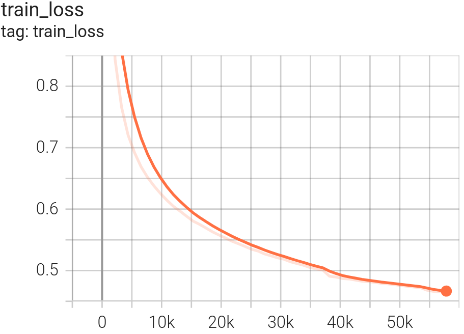
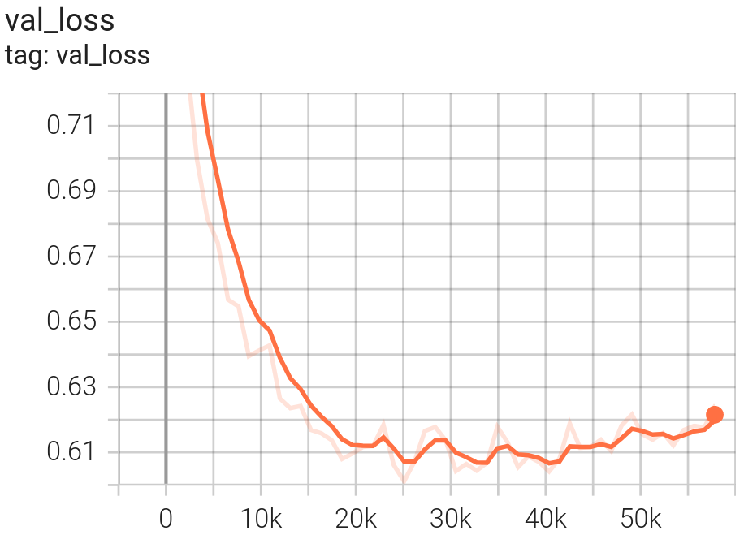
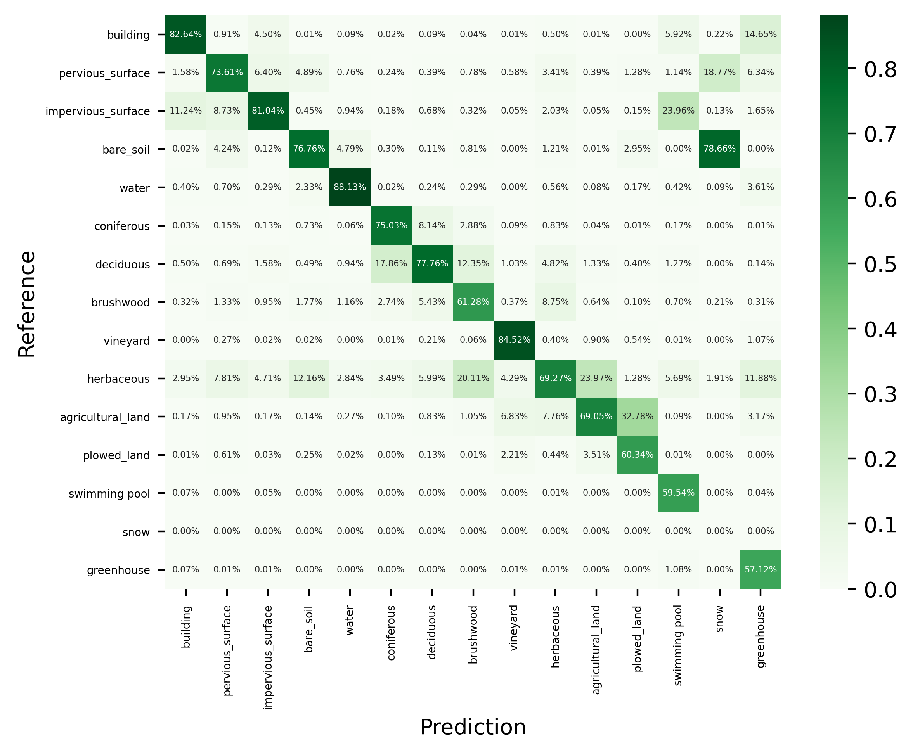
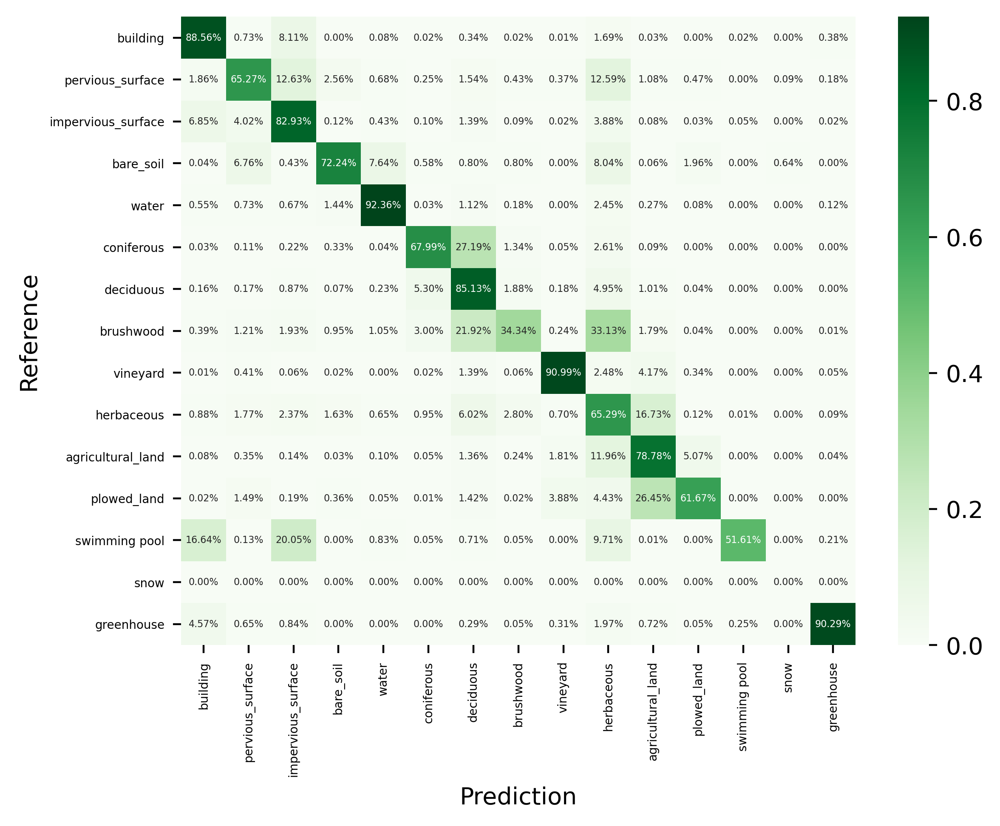

<div style="border:0px; padding:25px; background-color:#F8F5F5; padding-top:10px; padding-bottom:1px;">
  <h1>FLAIR model collection</h1>
  <p>The FLAIR models are a collection of semantic segmentation models initially developed to classify land cover on very high resolution aerial images (more specifically the French <a href="https://geoservices.ign.fr/bdortho">BD ORTHO®</a> product). The distributed pre-trained models differ in their :</p>
  <ul style="list-style-type:disc;">
    <li>dataset for training : <a href="https://huggingface.co/datasets/IGNF/FLAIR"><b>FLAIR</b> dataset</a> or the increased version of this dataset <b>FLAIR-INC</b> (x 3.5 patches). Only the FLAIR dataset is open at the moment.</li>
    <li>input modalities : <b>RGB</b> (natural colours), <b>RGBI</b> (natural colours + infrared), <b>RGBIE</b> (natural colours + infrared + elevation)</li>
    <li>model architecture : <b>resnet34_unet</b> (U-Net with a Resnet-34 encoder), <b>deeplab</b>, <b>fpn</b>, <b>mit</b></li>
    <li>target class nomenclature : <b>12cl</b> (12 land cover classes) or <b>15cl</b> (15 land cover classes)</li>
  </ul>
</div>
<br>

<div style="border:1px solid black; padding:25px; background-color:#FDFFF4 ; padding-top:10px; padding-bottom:1px;">
  <h1>FLAIR-INC_rgb_15cl_resnet34-deeplabv3</h1> 
  <p>The general characteristics of this specific model <strong>FLAIR-INC_rgb_15cl_resnet34-deeplabv3</strong> are :</p>
  <ul style="list-style-type:disc;">
    <li>Trained with the FLAIR-INC dataset</li>
    <li>Trained with the SegmentationModelsPytorch library</li>  
    <li>RGB images (true colours)</li>
    <li>DeepLabV3 with a Resnet-34 encoder</li>
    <li>15 class nomenclature : [building, pervious surface, impervious surface, bare soil, water, coniferous, deciduous, brushwood, vineyard, herbaceous, agricultural land, plowed land, swimming pool, snow, greenhouse]</li>
  </ul>
</div>

## Model Informations
- **Code repository:** https://github.com/IGNF/FLAIR-1
- **Paper:** https://arxiv.org/pdf/2211.12979.pdf
- **Developed by:** IGN
- **Compute infrastructure:** 
    - software: python, pytorch-lightning
    - hardware: HPC/AI resources provided by GENCI-IDRIS
- **License:** Etalab 2.0

---

## Uses

Although the model can be applied to other type of very high spatial earth observation images, it was initially developed to tackle the problem of classifying aerial images acquired on the French Territory.
The product called ([BD ORTHO®](https://geoservices.ign.fr/bdortho)) has its own spatial and radiometric specifications. The model is not intended to be generic to other type of very high spatial resolution images but specific to BD ORTHO images. 
Consequently, the model’s prediction would improve if the user images are similar to the original ones.

_**Radiometry of input images**_ :
The BD ORTHO input images are distributed in 8-bit encoding format per channel. When traning the model, input normalization was performed (see section **Training Details**). 
It is recommended that the user apply the same type of input normalization while inferring the model.

_**Multi-domain model**_ :
The FLAIR-INC dataset that was used for training is composed of 75 radiometric domains. In the case of aerial images, domain shifts are frequent and are mainly due to : the date of acquisition of the aerial survey (from april to november), the spatial domain (equivalent to a french department administrative division) and downstream radiometric processing.
By construction (sampling 75 domains) the model is robust to these shifts, and can be applied to any images of the ([BD ORTHO® product](https://geoservices.ign.fr/bdortho)).

_**Land Cover classes of prediction**_ :
The orginial class nomenclature of the FLAIR Dataset encompasses 19 classes (See the [FLAIR dataset](https://huggingface.co/datasets/IGNF/FLAIR) page for details).
However 3 classes corresponding to uncertain labelisation (Mixed (16), Ligneous (17) and Other (19)) and 1 class with very poor labelling (Clear cut (15)) were desactivated during training.
As a result, the logits produced by the model are of size 19x1, but classes n° 15, 16, 17 and 19 should appear at 0 in the logits and should not be present in the final argmax product.


## Bias, Risks, Limitations and Recommendations

_**Using the model on input images with other spatial resolution**_ :
The FLAIR-INC_rgb_15cl_resnet34-deeplabv3 model was trained with fixed scale conditions. All patches used for training are derived from aerial images with 0.2 meters spatial resolution. Only flip and rotate augmentations were performed during the training process.  
No data augmentation method concerning scale change was used during training. The user should pay attention that generalization issues can occur while applying this model to images that have different spatial resolutions.

_**Using the model for other remote sensing sensors**_ :
The FLAIR-INC_rgb_15cl_resnet34-deeplabv3 model was trained with aerial images of the ([BD ORTHO® product](https://geoservices.ign.fr/bdortho)) that encopass very specific radiometric image processing. 
Using the model on other type of aerial images or satellite images may imply the use of transfer learning or domain adaptation techniques.

_**Using the model on other spatial areas**_ :
The FLAIR-INC_rgb_15cl_resnet34-deeplabv3 model was trained on patches reprensenting the French Metropolitan territory. 
The user should be aware that applying the model to other type of landscapes may imply a drop in model metrics.  

---

## How to Get Started with the Model

Visit ([https://github.com/IGNF/FLAIR-1](https://github.com/IGNF/FLAIR-1)) to use the model.
Fine-tuning and prediction tasks are detailed in the README file.


---

## Training Details

### Training Data

218 400 patches of 512 x 512 pixels were used to train the **FLAIR-INC_rgb_15cl_resnet34-deeplabv3** model. 
The train/validation split was performed patchwise to obtain a 80% / 20% distribution between train and validation. 
Annotation was performed at the _zone_ level (~100 patches per _zone_). Spatial independancy between patches is guaranted as patches from the same _zone_ were assigned to the same set (TRAIN or VALIDATION). 
The following number of patches were used for train and validation :
| TRAIN set            | 174 700 patches    |
| VALIDATION set       | 43 700 patchs      |


### Training Procedure

#### Preprocessing

For traning the model, input normalization was performed to center-reduce (**a mean=0** and a **standard deviation = 1**, channel wise) the dataset.
We used the statistics of TRAIN+VALIDATION for input normalization. It is recommended that the user apply the same type of input normalization. 

Statistics of the TRAIN+VALIDATION set :

| Modalities              | Mean (Train + Validation)       |Std    (Train + Validation)     |
| ----------------------- | ----------- |----------- |
| Red Channel (R)         | 105.08	    |52.17       |
| Green Channel (G)       | 110.87      |45.38       |
| Blue Channel (B)        | 101.82	    |44.00       |


#### Training Hyperparameters

```yaml
- Model architecture: DeepLabV3 #(implementation from the [Segmentation Models Pytorch library](https://segmentation-modelspytorch.readthedocs.io/en/latest/docs/api.html#unet))
- Encoder : Resnet-34 pre-trained with ImageNet
- Augmentation :
  - VerticalFlip(p=0.5)
  - HorizontalFlip(p=0.5)
  - RandomRotate90(p=0.5)
- Input normalization (mean=0 | std=1):
  - norm_means: [105.08, 110.87, 101.82]
  - norm_stds: [52.17, 45.38, 44]
- Seed: 2022
- Batch size: 10
- Number of epochs : 200
- Early stopping : patience 30 and val_loss as monitor criterium 
- Optimizer : SGD
- Schaeduler : mode = "min", factor = 0.5, patience = 10, cooldown = 4, min_lr = 1e-7
- Learning rate : 0.02
- Class Weights : [1-building: 1.0 , 2-pervious surface: 1.0 , 3-impervious surface: 1.0 , 4-bare soil: 1.0 , 5-water: 1.0 , 6-coniferous: 1.0 , 7-deciduous: 1.0 , 8-brushwood: 1.0 , 9-vineyard: 1.0 , 10-herbaceous vegetation: 1.0 , 11-agricultural land: 1.0 , 12-plowed land: 1.0 , 13-swimming_pool: 1.0 , 14-snow: 1.0 , 15-clear cut: 0.0 , 16-mixed: 0.0 , 17-ligneous: 0.0 , 18-greenhouse: 1.0 , 19-other: 0.0]
```

#### Speeds, Sizes, Times

The FLAIR-INC_rgb_15cl_resnet34-deeplabv3 model was trained on a HPC/AI resources provided by GENCI-IDRIS (Grant 2022-A0131013803). 
16 V100 GPUs were used ( 4 nodes, 4 GPUS per node). With this configuration the approximate learning time is 6 minutes per epoch.

FLAIR-INC_rgb_15cl_resnet34-deeplabv3  was obtained for num_epoch=22 with corresponding val_loss=0.60. 


<div style="position: relative; text-align: center;">
    <p style="margin: 0;">TRAIN loss</p>
    
    <p style="margin: 0;">VALIDATION loss</p>
    
</div>


## Evaluation

### Testing Data, Factors & Metrics

#### Testing Data

The evaluation was performed on a TEST set of 31 750 patches that are independant from the TRAIN and VALIDATION patches. They represent 15 spatio-temporal domains.
The TEST set corresponds to the reunion of the TEST set of scientific challenges FLAIR#1 and FLAIR#2. See the [FLAIR challenge page](https://ignf.github.io/FLAIR/) for more details.

The choice of a separate TEST set instead of cross validation was made to be coherent with the FLAIR challenges. 
However the metrics for the Challenge were calculated on 12 classes and the TEST set acordingly. 
As a result the _Snow_ class is absent from the TEST set.

#### Metrics

With the evaluation protocol, the **FLAIR-INC_rgb_15cl_resnet34-deeplabv3** have been evaluated to **OA= 74.887%** and **mIoU=58.093%**. 
The _snow_ class is discarded from the average metrics.

The following table give the class-wise metrics :

|   Classes               |   IoU (%)    | Fscore (%)  | Precision (%)  | Recall (%)  |
| ----------------------- | ----------|---------|---------|---------|
|  building   		      |   74.671   |   85.499   |   82.639   |   88.565   |
|  pervious_surface   	  |   52.890   |   69.187   |   73.606   |   65.269   |
|  impervious_surface     |   69.452   |   81.972   |   81.036   |   82.930   |
|  bare_soil   	          |   59.280   |   74.435   |   76.764   |   72.243   |
|  water   		          |   82.144   |   90.197   |   88.130   |   92.363   |
|  coniferous   	      |   55.443   |   71.336   |   75.030   |   67.988   |
|  deciduous   	          |   68.459   |   81.277   |   77.756   |   85.132   |
|  brushwood   	          |   28.215   |   44.012   |   61.283   |   34.336   |
|  vineyard   		      |   77.997   |   87.639   |   84.523   |   90.994   |
|  herbaceous   	      |   50.624   |   67.219   |   69.270   |   65.287   |
|  agricultural_land      |   58.221   |   73.595   |   69.052   |   78.777   |
|  plowed_land   	      |   43.881   |   60.996   |   60.336   |   61.671   |
|  swimming_pool   	      |   38.207   |   55.289   |   59.539   |   51.606   |
|  snow   		          |   _0.000_  |   _0.000_  |   _0.000_  |   _0.000_  |
|  greenhouse   	      |   53.815   |   69.974   |   57.120   |   90.293   |
| **average**             |  **58.093**    |  **72.331**  |  **72.577**  |  **73.390**  |


The following illustration gives the resulting confusion matrix :
* Top : normalised acording to columns, columns sum at 100% and the **precision** is on the diagonal of the matrix
* Bottom : normalised acording to rows, rows sum at 100% and the **recall** is on the diagonal of the matrix 


<div style="position: relative; text-align: center;">
    <p style="margin: 0;">Normalized Confusion Matrix (precision)</p>
    
    <p style="margin: 0;">Normalized Confusion Matrix (recall)</p>
    
</div>


### Results

Samples of results


---

## Citation


**BibTeX:**

```
@inproceedings{ign-flair,
      title={FLAIR: a Country-Scale Land Cover Semantic Segmentation Dataset From Multi-Source Optical Imagery}, 
      author={Anatol Garioud and Nicolas Gonthier and Loic Landrieu and Apolline De Wit and Marion Valette and Marc Poupée and Sébastien Giordano and Boris Wattrelos},
      year={2023},
      booktitle={Advances in Neural Information Processing Systems (NeurIPS) 2023},
      doi={https://doi.org/10.48550/arXiv.2310.13336},
}
```


**APA:**
```
Anatol Garioud, Nicolas Gonthier, Loic Landrieu, Apolline De Wit, Marion Valette, Marc Poupée, Sébastien Giordano and Boris Wattrelos. 2023. 
FLAIR: a Country-Scale Land Cover Semantic Segmentation Dataset From Multi-Source Optical Imagery. (2023).
In proceedings of Advances in Neural Information Processing Systems (NeurIPS) 2023.
DOI: https://doi.org/10.48550/arXiv.2310.13336
```

## Contact : flair@ign.fr
