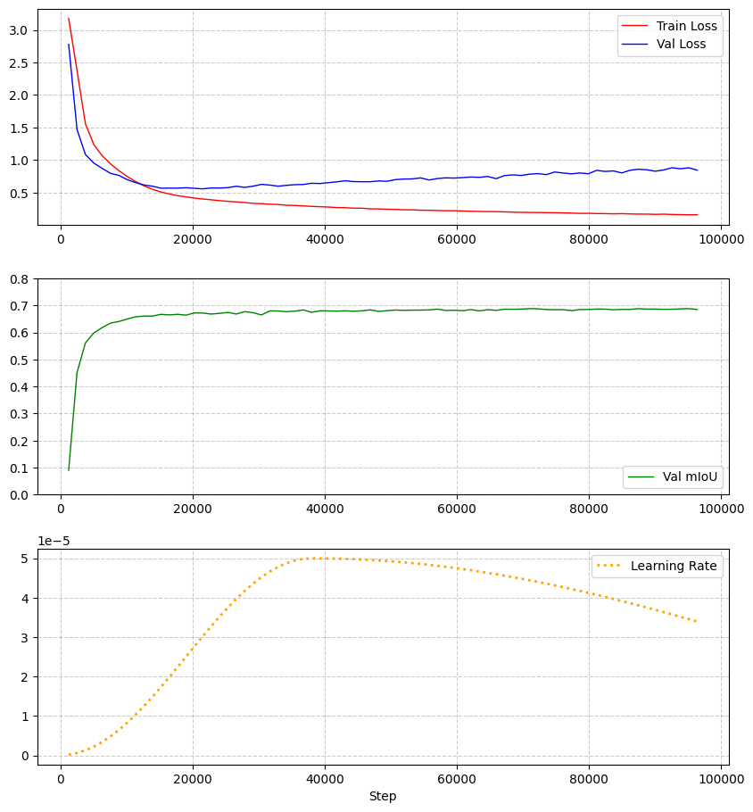

<div style="font-family:sans-serif; color:black; background-color:#F8F5F5; padding:25px; border-radius:10px; margin:auto; border:0px; ">

  <!-- Collection Section -->
  <div style="background:#FFFFFF; color:black; padding:20px; border-radius:8px; box-shadow:0 2px 5px rgba(0,0,0,0.05); margin-bottom:20px;">
    <h1 style="margin-top:0; color:black;">🌐 FLAIR-HUB Model Collection</h1>
    <ul style="padding-left:0; list-style:none; line-height:1.6; margin:0;">
      <li>
        <span style="display:inline-block; width:10px; height:10px; background:#555; border-radius:2px; margin-right:10px; box-shadow:1px 1px 2px rgba(0,0,0,0.2); vertical-align:middle;"></span>
      <b>Trained on</b>: <span style="color:black;">FLAIR-HUB dataset</span> 
      <a href="https://huggingface.co/datasets/IGNF/FLAIR-HUB" target="_blank" style="margin-left:5px;">🔗</a>
      </li>
      <li>
        <span style="display:inline-block; width:10px; height:10px; background:#555; border-radius:2px; margin-right:10px; box-shadow:1px 1px 2px rgba(0,0,0,0.2); vertical-align:middle;"></span>
        <b>Available modalities</b>: Aerial images, SPOT images, Topographic info, Sentinel-2 yearly time-series, Sentinel-1 yearly time-series, Historical aerial images
      </li>
      <li>
        <span style="display:inline-block; width:10px; height:10px; background:#555; border-radius:2px; margin-right:10px; box-shadow:1px 1px 2px rgba(0,0,0,0.2); vertical-align:middle;"></span>
        <b>Encoders</b>: ConvNeXTV2, Swin (Tiny, Small, Base, Large)
      </li>
      <li>
        <span style="display:inline-block; width:10px; height:10px; background:#555; border-radius:2px; margin-right:10px; box-shadow:1px 1px 2px rgba(0,0,0,0.2); vertical-align:middle;"></span>
        <b>Decoders</b>: UNet, UPerNet
      </li>
      <li>
        <span style="display:inline-block; width:10px; height:10px; background:#555; border-radius:2px; margin-right:10px; box-shadow:1px 1px 2px rgba(0,0,0,0.2); vertical-align:middle;"></span>
        <b>Tasks</b>: Land-cover mapping (LC), Crop-type mapping (LPIS)
      </li>
      <li>
        <span style="display:inline-block; width:10px; height:10px; background:#555; border-radius:2px; margin-right:10px; box-shadow:1px 1px 2px rgba(0,0,0,0.2); vertical-align:middle;"></span>
        <b>Class nomenclature</b>: 15 classes for LC, 23 classes for LPIS
      </li>
    </ul>
      <table border="1" style="border-collapse: collapse; width:100%; margin-bottom:15px; table-layout: fixed;">
      <thead>
        <tr>
          <th style="padding:1px;"></th>
          <th colspan="2" style="padding:1px; text-align:center; font-weight:bold; color:black;">
            Model task
          </th>
          <th colspan="6" style="padding:1px; text-align:center; font-weight:bold; color:black;">
            Model inputs
          </th>
        </tr>
        <tr>
          <th style="padding:1px; text-align:center; color:black; width:5%; white-space:nowrap; overflow:hidden; text-overflow:ellipsis;">🆔<br>Model ID</th>
          <th style="padding:1px; text-align:center; color:black; width:5%; white-space:nowrap; overflow:hidden; text-overflow:ellipsis;">🗺️<br>Land-cover</th>
          <th style="padding:1px; text-align:center; color:black; width:5%; white-space:nowrap; overflow:hidden; text-overflow:ellipsis;">🌾<br>Crop-types</th>
          <th style="padding:1px; text-align:center; color:black; width:5%; white-space:nowrap; overflow:hidden; text-overflow:ellipsis;">🛩️<br>Aerial</th>
          <th style="padding:1px; text-align:center; color:black; width:5%; white-space:nowrap; overflow:hidden; text-overflow:ellipsis;">⛰️<br>Elevation</th>
          <th style="padding:1px; text-align:center; color:black; width:5%; white-space:nowrap; overflow:hidden; text-overflow:ellipsis;">🛰️<br>SPOT</th>
          <th style="padding:1px; text-align:center; color:black; width:5%; white-space:nowrap; overflow:hidden; text-overflow:ellipsis;">🛰️<br>S2 t.s.</th>
          <th style="padding:1px; text-align:center; color:black; width:5%; white-space:nowrap; overflow:hidden; text-overflow:ellipsis;">🛰️<br>S1 t.s.</th>
          <th style="padding:1px; text-align:center; color:black; width:5%; white-space:nowrap; overflow:hidden; text-overflow:ellipsis;">🛩️<br>Historical</th>
        </tr>
      </thead>
      <tbody>
        <tr>
          <td style="padding:1px; width5%; white-space:nowrap; overflow:hidden; text-overflow:ellipsis;">LC-A</td>
          <td style="padding:1px; text-align:center; width5%; white-space:nowrap; overflow:hidden; text-overflow:ellipsis;">✓</td>
          <td style="padding:1px; text-align:center; width5%; white-space:nowrap; overflow:hidden; text-overflow:ellipsis;"></td>
          <td style="padding:1px; text-align:center; width5%; white-space:nowrap; overflow:hidden; text-overflow:ellipsis;">✓</td>
          <td style="padding:1px; text-align:center; width5%; white-space:nowrap; overflow:hidden; text-overflow:ellipsis;"></td>
          <td style="padding:1px; text-align:center; width5%; white-space:nowrap; overflow:hidden; text-overflow:ellipsis;"></td>
          <td style="padding:1px; text-align:center; width5%; white-space:nowrap; overflow:hidden; text-overflow:ellipsis;"></td>
          <td style="padding:1px; text-align:center; width5%; white-space:nowrap; overflow:hidden; text-overflow:ellipsis;"></td>
          <td style="padding:1px; text-align:center; width5%; white-space:nowrap; overflow:hidden; text-overflow:ellipsis;"></td>
        </tr>
        <tr>
          <td style="padding:1px; width5%; white-space:nowrap; overflow:hidden; text-overflow:ellipsis;">LC-B</td>
          <td style="padding:1px; text-align:center; width5%; white-space:nowrap; overflow:hidden; text-overflow:ellipsis;">✓</td>
          <td style="padding:1px; text-align:center; width5%; white-space:nowrap; overflow:hidden; text-overflow:ellipsis;"></td>
          <td style="padding:1px; text-align:center; width5%; white-space:nowrap; overflow:hidden; text-overflow:ellipsis;">✓</td>
          <td style="padding:1px; text-align:center; width5%; white-space:nowrap; overflow:hidden; text-overflow:ellipsis;">✓</td>
          <td style="padding:1px; text-align:center; width5%; white-space:nowrap; overflow:hidden; text-overflow:ellipsis;"></td>
          <td style="padding:1px; text-align:center; width5%; white-space:nowrap; overflow:hidden; text-overflow:ellipsis;"></td>
          <td style="padding:1px; text-align:center; width5%; white-space:nowrap; overflow:hidden; text-overflow:ellipsis;"></td>
          <td style="padding:1px; text-align:center; width5%; white-space:nowrap; overflow:hidden; text-overflow:ellipsis;"></td>
        </tr> 
        <tr>
          <td style="padding:1px; width5%; white-space:nowrap; overflow:hidden; text-overflow:ellipsis;">LC-D</td>
          <td style="padding:1px; text-align:center; width5%; white-space:nowrap; overflow:hidden; text-overflow:ellipsis;">✓</td>
          <td style="padding:1px; text-align:center; width5%; white-space:nowrap; overflow:hidden; text-overflow:ellipsis;"></td>
          <td style="padding:1px; text-align:center; width5%; white-space:nowrap; overflow:hidden; text-overflow:ellipsis;">✓</td>
          <td style="padding:1px; text-align:center; width5%; white-space:nowrap; overflow:hidden; text-overflow:ellipsis;"></td>
          <td style="padding:1px; text-align:center; width5%; white-space:nowrap; overflow:hidden; text-overflow:ellipsis;"></td>
          <td style="padding:1px; text-align:center; width5%; white-space:nowrap; overflow:hidden; text-overflow:ellipsis;">✓</td>
          <td style="padding:1px; text-align:center; width5%; white-space:nowrap; overflow:hidden; text-overflow:ellipsis;"></td>
          <td style="padding:1px; text-align:center; width5%; white-space:nowrap; overflow:hidden; text-overflow:ellipsis;"></td>
        </tr>
        <tr>
          <td style="padding:1px; width5%; white-space:nowrap; overflow:hidden; text-overflow:ellipsis;">LC-F</td>
          <td style="padding:1px; text-align:center; width5%; white-space:nowrap; overflow:hidden; text-overflow:ellipsis;">✓</td>
          <td style="padding:1px; text-align:center; width5%; white-space:nowrap; overflow:hidden; text-overflow:ellipsis;"></td>
          <td style="padding:1px; text-align:center; width5%; white-space:nowrap; overflow:hidden; text-overflow:ellipsis;">✓</td>
          <td style="padding:1px; text-align:center; width5%; white-space:nowrap; overflow:hidden; text-overflow:ellipsis;"></td>
          <td style="padding:1px; text-align:center; width5%; white-space:nowrap; overflow:hidden; text-overflow:ellipsis;"></td>
          <td style="padding:1px; text-align:center; width5%; white-space:nowrap; overflow:hidden; text-overflow:ellipsis;">✓</td>
          <td style="padding:1px; text-align:center; width5%; white-space:nowrap; overflow:hidden; text-overflow:ellipsis;">✓</td>
          <td style="padding:1px; text-align:center; width5%; white-space:nowrap; overflow:hidden; text-overflow:ellipsis;"></td>
        </tr>
        <tr>
          <td style="padding:1px; width5%; white-space:nowrap; overflow:hidden; text-overflow:ellipsis;">LC-G</td>
          <td style="padding:1px; text-align:center; width5%; white-space:nowrap; overflow:hidden; text-overflow:ellipsis;">✓</td>
          <td style="padding:1px; text-align:center; width5%; white-space:nowrap; overflow:hidden; text-overflow:ellipsis;"></td>
          <td style="padding:1px; text-align:center; width5%; white-space:nowrap; overflow:hidden; text-overflow:ellipsis;"></td>
          <td style="padding:1px; text-align:center; width5%; white-space:nowrap; overflow:hidden; text-overflow:ellipsis;"></td>
          <td style="padding:1px; text-align:center; width5%; white-space:nowrap; overflow:hidden; text-overflow:ellipsis;"></td>
          <td style="padding:1px; text-align:center; width5%; white-space:nowrap; overflow:hidden; text-overflow:ellipsis;">✓</td>
          <td style="padding:1px; text-align:center; width5%; white-space:nowrap; overflow:hidden; text-overflow:ellipsis;"></td>
          <td style="padding:1px; text-align:center; width5%; white-space:nowrap; overflow:hidden; text-overflow:ellipsis;"></td>
        </tr>
        <tr>
          <td style="padding:1px; width5%; white-space:nowrap; overflow:hidden; text-overflow:ellipsis;">LC-I</td>
          <td style="padding:1px; text-align:center; width5%; white-space:nowrap; overflow:hidden; text-overflow:ellipsis;">✓</td>
          <td style="padding:1px; text-align:center; width5%; white-space:nowrap; overflow:hidden; text-overflow:ellipsis;"></td>
          <td style="padding:1px; text-align:center; width5%; white-space:nowrap; overflow:hidden; text-overflow:ellipsis;"></td>
          <td style="padding:1px; text-align:center; width5%; white-space:nowrap; overflow:hidden; text-overflow:ellipsis;"></td>
          <td style="padding:1px; text-align:center; width5%; white-space:nowrap; overflow:hidden; text-overflow:ellipsis;">✓</td>
          <td style="padding:1px; text-align:center; width5%; white-space:nowrap; overflow:hidden; text-overflow:ellipsis;"></td>
          <td style="padding:1px; text-align:center; width5%; white-space:nowrap; overflow:hidden; text-overflow:ellipsis;"></td>
          <td style="padding:1px; text-align:center; width5%; white-space:nowrap; overflow:hidden; text-overflow:ellipsis;"></td>
        </tr>
        <tr>
          <td style="padding:1px; width5%; white-space:nowrap; overflow:hidden; text-overflow:ellipsis;">LC-L</td>
          <td style="padding:1px; text-align:center; width5%; white-space:nowrap; overflow:hidden; text-overflow:ellipsis;">✓</td>
          <td style="padding:1px; text-align:center; width5%; white-space:nowrap; overflow:hidden; text-overflow:ellipsis;"></td>
          <td style="padding:1px; text-align:center; width5%; white-space:nowrap; overflow:hidden; text-overflow:ellipsis;">✓</td>
          <td style="padding:1px; text-align:center; width5%; white-space:nowrap; overflow:hidden; text-overflow:ellipsis;">✓</td>
          <td style="padding:1px; text-align:center; width5%; white-space:nowrap; overflow:hidden; text-overflow:ellipsis;">✓</td>
          <td style="padding:1px; text-align:center; width5%; white-space:nowrap; overflow:hidden; text-overflow:ellipsis;">✓</td>
          <td style="padding:1px; text-align:center; width5%; white-space:nowrap; overflow:hidden; text-overflow:ellipsis;">✓</td>
          <td style="padding:1px; text-align:center; width5%; white-space:nowrap; overflow:hidden; text-overflow:ellipsis;"></td>
        </tr>
        <tr>
          <td style="padding:1px; width5%; white-space:nowrap; overflow:hidden; text-overflow:ellipsis;">LPIS-A</td>
          <td style="padding:1px; text-align:center; width5%; white-space:nowrap; overflow:hidden; text-overflow:ellipsis;"></td>
          <td style="padding:1px; text-align:center; width5%; white-space:nowrap; overflow:hidden; text-overflow:ellipsis;">✓</td>
          <td style="padding:1px; text-align:center; width5%; white-space:nowrap; overflow:hidden; text-overflow:ellipsis;">✓</td>
          <td style="padding:1px; text-align:center; width5%; white-space:nowrap; overflow:hidden; text-overflow:ellipsis;"></td>
          <td style="padding:1px; text-align:center; width5%; white-space:nowrap; overflow:hidden; text-overflow:ellipsis;"></td>
          <td style="padding:1px; text-align:center; width5%; white-space:nowrap; overflow:hidden; text-overflow:ellipsis;"></td>
          <td style="padding:1px; text-align:center; width5%; white-space:nowrap; overflow:hidden; text-overflow:ellipsis;"></td>
          <td style="padding:1px; text-align:center; width5%; white-space:nowrap; overflow:hidden; text-overflow:ellipsis;"></td>
        </tr>
        <tr>
          <td style="padding:1px; width5%; white-space:nowrap; overflow:hidden; text-overflow:ellipsis;">LPIS-F</td>
          <td style="padding:1px; text-align:center; width5%; white-space:nowrap; overflow:hidden; text-overflow:ellipsis;"></td>
          <td style="padding:1px; text-align:center; width5%; white-space:nowrap; overflow:hidden; text-overflow:ellipsis;">✓</td>
          <td style="padding:1px; text-align:center; width5%; white-space:nowrap; overflow:hidden; text-overflow:ellipsis;"></td>
          <td style="padding:1px; text-align:center; width5%; white-space:nowrap; overflow:hidden; text-overflow:ellipsis;"></td>
          <td style="padding:1px; text-align:center; width5%; white-space:nowrap; overflow:hidden; text-overflow:ellipsis;"></td>
          <td style="padding:1px; text-align:center; width5%; white-space:nowrap; overflow:hidden; text-overflow:ellipsis;">✓</td>
          <td style="padding:1px; text-align:center; width5%; white-space:nowrap; overflow:hidden; text-overflow:ellipsis;"></td>
          <td style="padding:1px; text-align:center; width5%; white-space:nowrap; overflow:hidden; text-overflow:ellipsis;"></td>
        </tr>
        <tr>
          <td style="padding:1px; width5%; white-space:nowrap; overflow:hidden; text-overflow:ellipsis;">LPIS-I</td>
          <td style="padding:1px; text-align:center; width5%; white-space:nowrap; overflow:hidden; text-overflow:ellipsis;"></td>
          <td style="padding:1px; text-align:center; width5%; white-space:nowrap; overflow:hidden; text-overflow:ellipsis;">✓</td>
          <td style="padding:1px; text-align:center; width5%; white-space:nowrap; overflow:hidden; text-overflow:ellipsis;"></td>
          <td style="padding:1px; text-align:center; width5%; white-space:nowrap; overflow:hidden; text-overflow:ellipsis;"></td>
          <td style="padding:1px; text-align:center; width5%; white-space:nowrap; overflow:hidden; text-overflow:ellipsis;">✓</td>
          <td style="padding:1px; text-align:center; width5%; white-space:nowrap; overflow:hidden; text-overflow:ellipsis;">✓</td>
          <td style="padding:1px; text-align:center; width5%; white-space:nowrap; overflow:hidden; text-overflow:ellipsis;">✓</td>
          <td style="padding:1px; text-align:center; width5%; white-space:nowrap; overflow:hidden; text-overflow:ellipsis;"></td>
        </tr>
        <tr>
          <td style="padding:1px; width5%; white-space:nowrap; overflow:hidden; text-overflow:ellipsis;">LPIS-J</td>
          <td style="padding:1px; text-align:center; width5%; white-space:nowrap; overflow:hidden; text-overflow:ellipsis;"></td>
          <td style="padding:1px; text-align:center; width5%; white-space:nowrap; overflow:hidden; text-overflow:ellipsis;">✓</td>
          <td style="padding:1px; text-align:center; width5%; white-space:nowrap; overflow:hidden; text-overflow:ellipsis;">✓</td>
          <td style="padding:1px; text-align:center; width5%; white-space:nowrap; overflow:hidden; text-overflow:ellipsis;"></td>
          <td style="padding:1px; text-align:center; width5%; white-space:nowrap; overflow:hidden; text-overflow:ellipsis;">✓</td>
          <td style="padding:1px; text-align:center; width5%; white-space:nowrap; overflow:hidden; text-overflow:ellipsis;">✓</td>
          <td style="padding:1px; text-align:center; width5%; white-space:nowrap; overflow:hidden; text-overflow:ellipsis;">✓</td>
          <td style="padding:1px; text-align:center; width5%; white-space:nowrap; overflow:hidden; text-overflow:ellipsis;"></td>
        </tr>
      </tbody>
    </table>
  </div>

  <!-- Model-Specific Section -->
  <div style="border:1px solid black; color:black; padding:25px; background-color:#FDFFF4; border-radius:8px; box-shadow:0 2px 5px rgba(0,0,0,0.05);">
    <h2 style="margin-top:0; color:black;">🔍 Model: FLAIR-HUB_LC-A_RVB_swinbase-upernet</h2>
    <ul style="padding-left:0; list-style:none; line-height:1.6; margin:0;">
      <li>
        <span style="display:inline-block; width:10px; height:10px; background:#555; border-radius:2px; margin-right:10px; box-shadow:1px 1px 2px rgba(0,0,0,0.2); vertical-align:middle;"></span>
        <b>Encoder</b>: <i>swin_base_patch4_window12_384</i>
      </li>
      <li>
        <span style="display:inline-block; width:10px; height:10px; background:#555; border-radius:2px; margin-right:10px; box-shadow:1px 1px 2px rgba(0,0,0,0.2); vertical-align:middle;"></span>
        <b>Decoder</b>: <i>upernet</i>
      </li>
      <li>
        <span style="display:inline-block; width:10px; height:10px; background:#555; border-radius:2px; margin-right:10px; box-shadow:1px 1px 2px rgba(0,0,0,0.2); vertical-align:middle;"></span>
        <b>Metrics</b>:
      </li>  
<table border="1" style="border-collapse: collapse; width:100%; margin-bottom:15px; table-layout: fixed;">
<thead>
  <tr>
    <th style="padding:1px; text-align:center; color:black; width:5%; white-space:nowrap; overflow:hidden; text-overflow:ellipsis;">mIoU</th>
    <th style="padding:1px; text-align:center; color:black; width:5%; white-space:nowrap; overflow:hidden; text-overflow:ellipsis;">O.A.</th>
    <th style="padding:1px; text-align:center; color:black; width:5%; white-space:nowrap; overflow:hidden; text-overflow:ellipsis;">F-score</th>
    <th style="padding:1px; text-align:center; color:black; width:5%; white-space:nowrap; overflow:hidden; text-overflow:ellipsis;">Precision</th>
    <th style="padding:1px; text-align:center; color:black; width:5%; white-space:nowrap; overflow:hidden; text-overflow:ellipsis;">Recall</th>
  </tr>
</thead>
<tr>
  <td style="padding:1px; text-align:center; width5%; white-space:nowrap; overflow:hidden; text-overflow:ellipsis;">64.05%</td>
  <td style="padding:1px; text-align:center; width5%; white-space:nowrap; overflow:hidden; text-overflow:ellipsis;">76.78%</td>
  <td style="padding:1px; text-align:center; width5%; white-space:nowrap; overflow:hidden; text-overflow:ellipsis;">76.88%</td>
  <td style="padding:1px; text-align:center; width5%; white-space:nowrap; overflow:hidden; text-overflow:ellipsis;">77.71%</td>
  <td style="padding:1px; text-align:center; width5%; white-space:nowrap; overflow:hidden; text-overflow:ellipsis;">76.59%</td>
</tr>
</table>
      <li>
        <span style="display:inline-block; width:10px; height:10px; background:#555; border-radius:2px; margin-right:10px; box-shadow:1px 1px 2px rgba(0,0,0,0.2); vertical-align:middle;"></span>
        <b>Params.</b>: <i>89.4</i>
      </li>
    </ul>
  </div>
</div>


---

## General Informations
- **Contact:** flair@ign.fr
- **Code repository:** https://github.com/IGNF/FLAIR-HUB
- **Paper:** https://huggingface.co/papers/2506.07080
- **Developed by:** IGN
- **Compute infrastructure:** 
    - software: python, pytorch-lightning
    - hardware: HPC/AI resources provided by GENCI-IDRIS
- **License:** Etalab 2.0

---


### Training Config Hyperparameters

```yaml
- Model architecture: swin_base_patch4_window12_384-upernet
- Optimizer: AdamW (betas=[0.9, 0.999], weight_decay=0.01)
- Learning rate: 5e-5
- Scheduler: one_cycle_lr (warmup_fraction=0.2)
- Epochs: 150
- Batch size: 5
- Seed: 2025
- Early stopping: patience 20, monitor val_miou (mode=max)
- Class weights:
    - default: 1.0
    - masked classes: [clear cut, ligneous, mixed, other] → weight = 0
- Input channels:
    - AERIAL_RGBI : [1,2,3]
- Input normalization (custom):
    - AERIAL_RGBI:
        mean: [105.66, 111.35, 102.18 ]
        std:  [52.23, 45.62, 44.30]
```

---

### Training Data

```yaml
- Train patches: 152225
- Validation patches: 38175
- Test patches: 50700
```

<div style="position: relative; text-align: center;">
    
</div>

---

### Training Logging

<div style="position: relative; text-align: center;">
    
</div>

---


## Metrics


| Metric           | Value  |
| ---------------- | ------ |
| mIoU             | 64.05% |
| Overall Accuracy | 76.78% |
| F-score          | 76.88% |
| Precision        | 77.71% |
| Recall           | 76.59% |

| Class                 | IoU (%) | F-score (%) | Precision (%) | Recall (%) |
| --------------------- | ------- | ----------- | ------------- | ---------- |
| building              | 83.77   | 91.17       | 91.42         | 90.92      |
| greenhouse            | 77.89   | 87.57       | 85.28         | 89.99      |
| swimming pool         | 58.50   | 73.82       | 77.36         | 70.58      |
| impervious surface    | 75.03   | 85.73       | 87.13         | 84.38      |
| pervious surface      | 56.97   | 72.59       | 70.18         | 75.17      |
| bare soil             | 65.21   | 78.94       | 74.64         | 83.78      |
| water                 | 90.08   | 94.78       | 95.00         | 94.57      |
| snow                  | 67.77   | 80.79       | 97.53         | 68.95      |
| herbaceous vegetation | 52.85   | 69.15       | 71.87         | 66.64      |
| agricultural land     | 56.53   | 72.23       | 68.13         | 76.85      |
| plowed land           | 37.34   | 54.38       | 51.25         | 57.91      |
| vineyard              | 78.88   | 88.19       | 86.89         | 89.53      |
| deciduous             | 70.07   | 82.40       | 81.00         | 83.85      |
| coniferous            | 58.95   | 74.17       | 79.78         | 69.30      |
| brushwood             | 30.97   | 47.30       | 48.20         | 46.43      |


---


## Inference

<div style="display: flex; justify-content: center; text-align: center; gap: 20px;">

  <div style="flex: 1;">
    <p style="margin: 0;">Aerial ROI</p>
    
  </div>
  <div style="flex: 1;">
    <p style="margin: 0;">Inference ROI</p>
    
  </div>
</div>


---


## Cite


**BibTeX:**

```
@article{GARIOUD2026271,
title = {FLAIR-HUB: Large-scale multimodal dataset for land cover and crop mapping},
author = {Anatol Garioud and Sébastien Giordano and Nicolas David and Nicolas Gonthier},
journal = {ISPRS Journal of Photogrammetry and Remote Sensing},
volume = {237},
pages = {271-300},
year = {2026},
issn = {0924-2716},
doi = {https://doi.org/10.1016/j.isprsjprs.2026.04.017},
url = {https://www.sciencedirect.com/science/article/pii/S0924271626001899},
}
```

**APA:**
```
Anatol Garioud, Sébastien Giordano, Nicolas David, Nicolas Gonthier. 
FLAIR-HUB: Large-scale Multimodal Dataset for Land Cover and Crop Mapping.
ISPRS Journal of Photogrammetry and Remote Sensing, Volume 237, 2026.
DOI: https://doi.org/10.1016/j.isprsjprs.2026.04.017
```